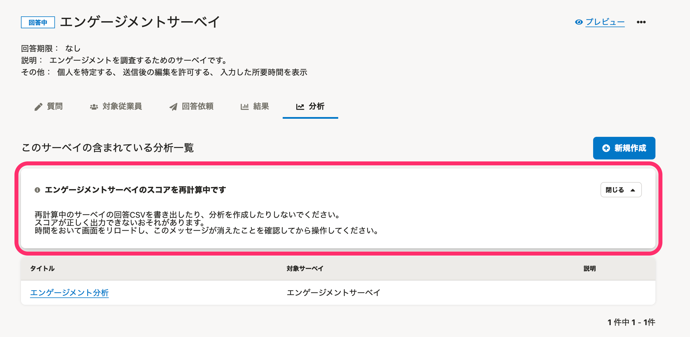
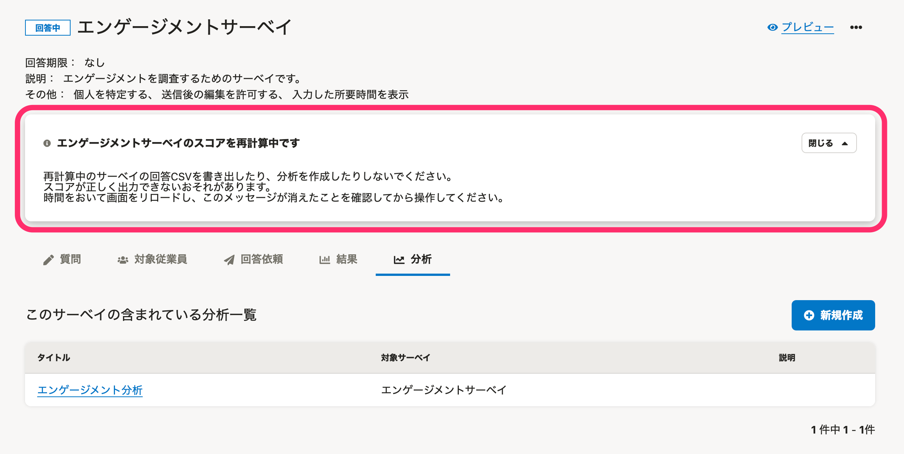

2021年5月20日（木）〜26日（水）に行なったアップデートの詳細をお知らせします。

従業員サーベイ機能の変更点は、カイゼン1件でした。

# 📈 カイゼン

## スコア再計算中のインフォメーションパネルの表示位置を変更しました

これまでは、 **［分析］** タブの中にスコア再計算中のインフォメーションパネルを表示していたため、他のタブに移動すると、スコアの再計算の状況が見えなくなっていました。

そのため今回の改修で、インフォメーションパネルをタブの外に移動し、タブを移動してもスコア再計算の状況を確認できるようにしました。

| 変更前 |  |
| --- | --- |
| 変更後 |  |
