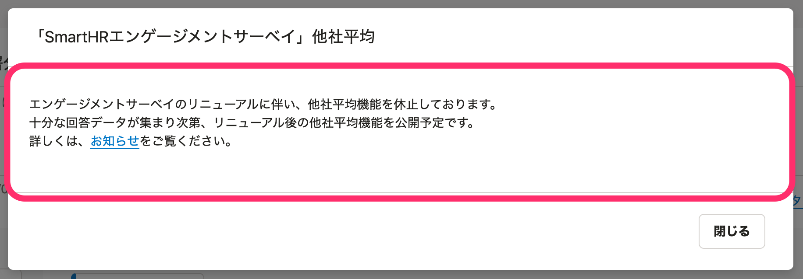
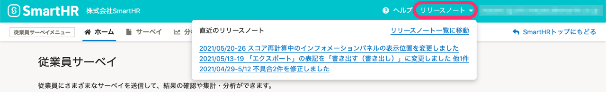

2021年5月27日（木）〜6月2日（水）に行なったアップデートの詳細をお知らせします。

従業員サーベイ機能の変更点は、カイゼン2件でした。

# 📈 カイゼン

## エンゲージメントサーベイをリニューアルしました

これまでは、人によって受け取りかたが変わるような、答えにくい質問がありました。

また、「別の視点でも組織状況を把握したい」という声をいただいていました。

そこで、今回のリニューアルで、エンゲージメントサーベイの質問の内容や、質問の分類（質問タグ）を見直し、エンゲージメントをより正確に測定できるようにしました。

また、リニューアルに伴い、下記の点も変更しています。

- サンプルの分析の内容をリニューアル後のエンゲージメントサーベイに変更しました。
- リニューアル後のエンゲージメントサーベイの他社平均機能を一時的に休止しました。

お知らせページもあわせてご覧ください。

:::related
[【従業員サーベイ】エンゲージメントサーベイの質問項目を一部変更します｜SmartHR](https://smarthr.jp/update/25118)
:::

## ヘッダーからリリースノートを確認できるようにしました

これまでは、リリースノートへのリンクがなく、従業員サーベイ機能のアップデート内容を把握しづらい状況でした。

そこで、今回のアップデートで、従業員サーベイ機能のヘッダーに **［リリースノート］** を追加し、新機能やカイゼンなどのリリース情報を確認しやすくしました。

| 変更前 |  |
| --- | --- |
| 変更後 |  |
