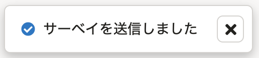
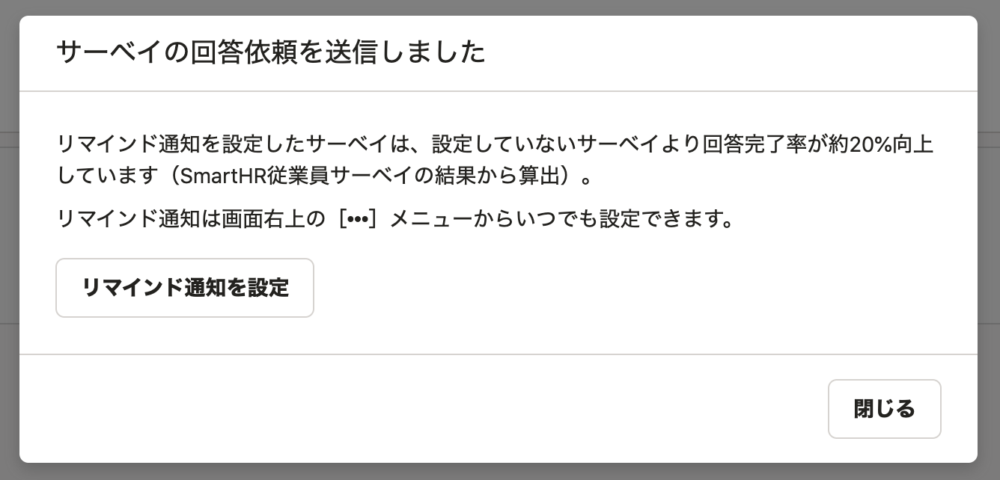

2021年6月3日（金）に行なったアップデートの詳細をお知らせします。

従業員サーベイ機能の変更点は、カイゼン1件・不具合修正1件でした。

# 📈 カイゼン

## 回答依頼の送信後にリマインド通知の設定を促すダイアログを表示するようにしました

これまでは、 **［回答依頼］** タブで **［送信］** をクリックした後は送信完了のフラッシュメッセージが出るのみでした。

今回のアップデートでは、サーベイの回答を回収しやすくするために、 **［送信］** をクリックした後に、リマインド通知の設定を促すダイアログを表示するようにしました。

 **［リマインド通知を設定］** をクリックすると設定ダイアログが表示され、すぐにリマインド通知を設定できます。

:::related
[サーベイへの回答をリマインドする](https://knowledge.smarthr.jp/hc/ja/articles/360052748454)
:::

# 👨‍⚕️ 不具合修正

回答CSVの書き出しや分析の際の上限値に関する1件の不具合修正を行ないました。
