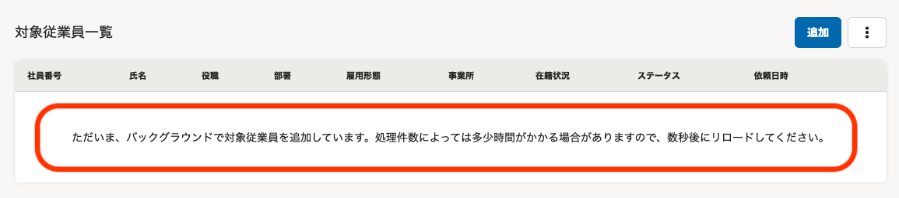
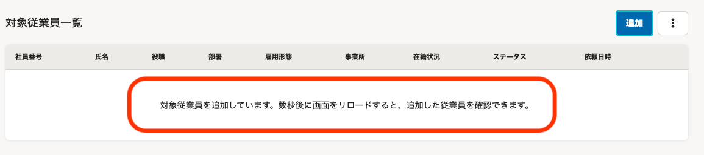
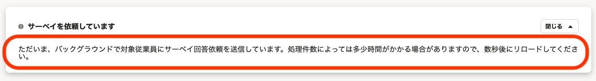
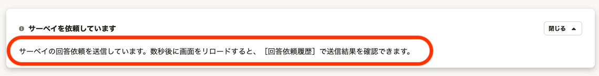
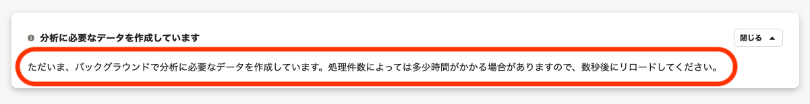
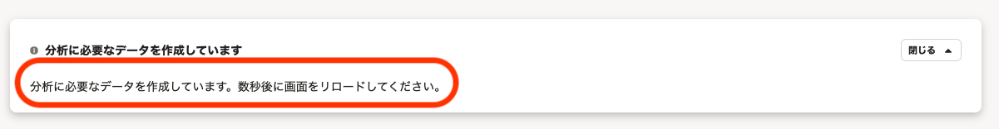

2021年6月7日（月）〜11日（金）に行なったアップデートの詳細をお知らせします。

従業員サーベイ機能の変更点は、カイゼン1件・不具合修正1件でした。

# 📈 カイゼン

## 分析の作成中などに表示されるメッセージの表現を変更しました

これまでは、分析の作成中や回答依頼の送信中のメッセージに、「バックグラウンドで」という表記がありましたが、実際は **［バックグラウンド処理］** 画面に表示されない処理のため、わかりづらいメッセージとなっていました。

今回のリリースで、「バックグラウンドで」という表現を削除したうえで、よりわかりやすいメッセージに変更しました。

変更箇所は下記のとおりです。

- 対象従業員の追加中

| 変更前 |  |
| --- | --- |
| 変更後 |  |

- 回答依頼の送信中

| 変更前 |  |
| --- | --- |
| 変更後 |  |

- 分析の作成中

| 変更前 |  |
| --- | --- |
| 変更後 |  |

# 👨‍⚕️ 不具合修正

Internet Explorer 11での画面表示に関する1件の不具合修正を行ないました。
