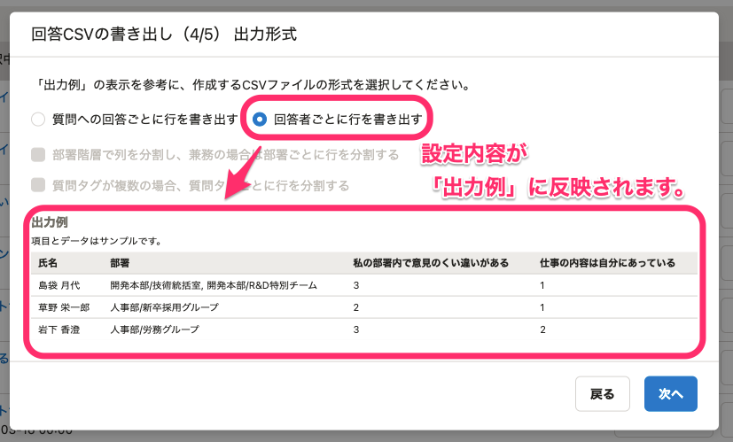

2021年6月21日（月）〜25日（金）に行なったアップデートの詳細をお知らせします。

従業員サーベイ機能の変更点は、カイゼン1件でした。

# 📈 カイゼン

## ［回答CSVの書き出し］ダイアログでCSVファイルの出力例を表示するようにしました

これまでは、CSVファイルの書き出し形式の設定が複雑で、実際に書き出されるCSVファイルがイメージしづらくなっていました。

今回のカイゼンで、選択した内容がサンプルのデータで確認できる **「出力例」** を表示するようにし、文言もイメージしやすいものに見直しました。

 **「出力例」** を確認しながら設定することで、目的に合わせたCSVファイルが書き出しやすくなりました。

あわせて、CSVファイルの書き出し形式の設定を新しいダイアログに分割する対応、各ダイアログの設定内容をタイトルに記載する対応をしました。
