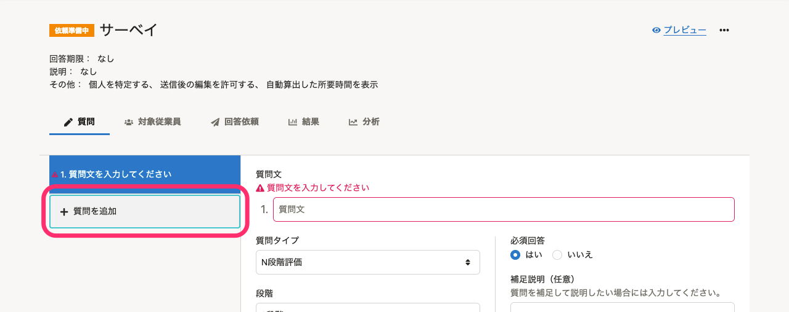

2021年6月28日（月）〜7月2日（金）に行なったアップデートの詳細をお知らせします。

従業員サーベイ機能の変更点は、アクセシビリティ1件・不具合修正1件でした。

# 🎢 アクセシビリティ

## サーベイへの質問の追加をキーボード操作でもできるようにしました

これまでは、 **［＋質問を追加］** をtabキーなどで選択できませんでしたが、今回のリリースでキーボード操作でも選択できるようにしました。

# 👨‍⚕️ 不具合修正

サーベイの質問の表示に関する1件の不具合修正を行ないました。
