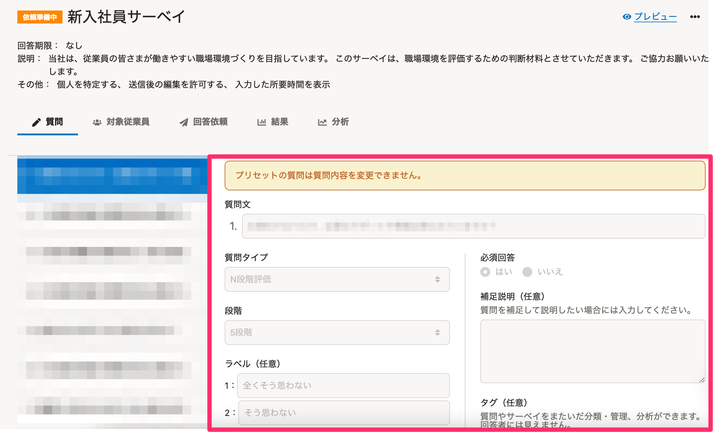
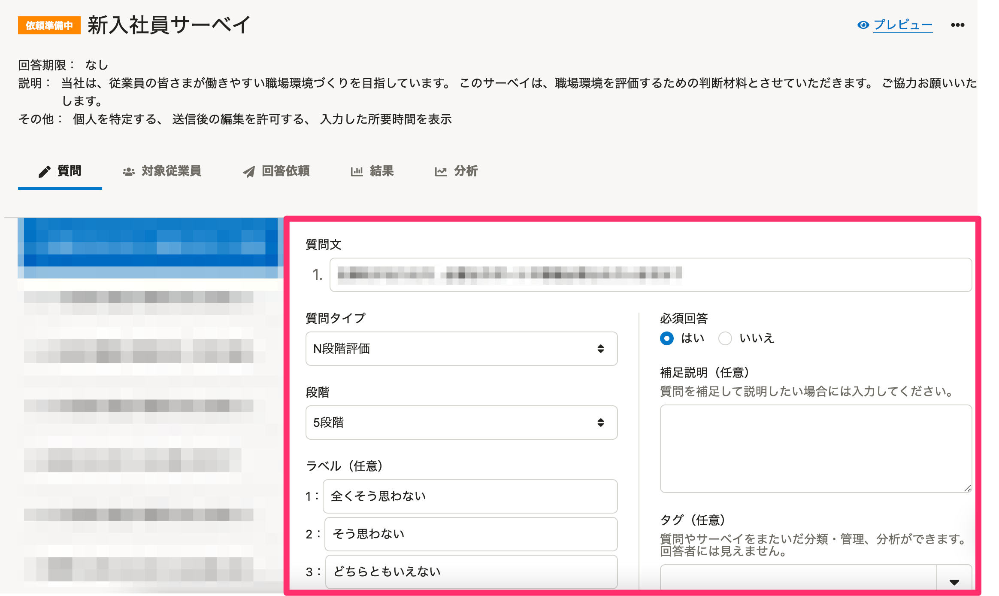
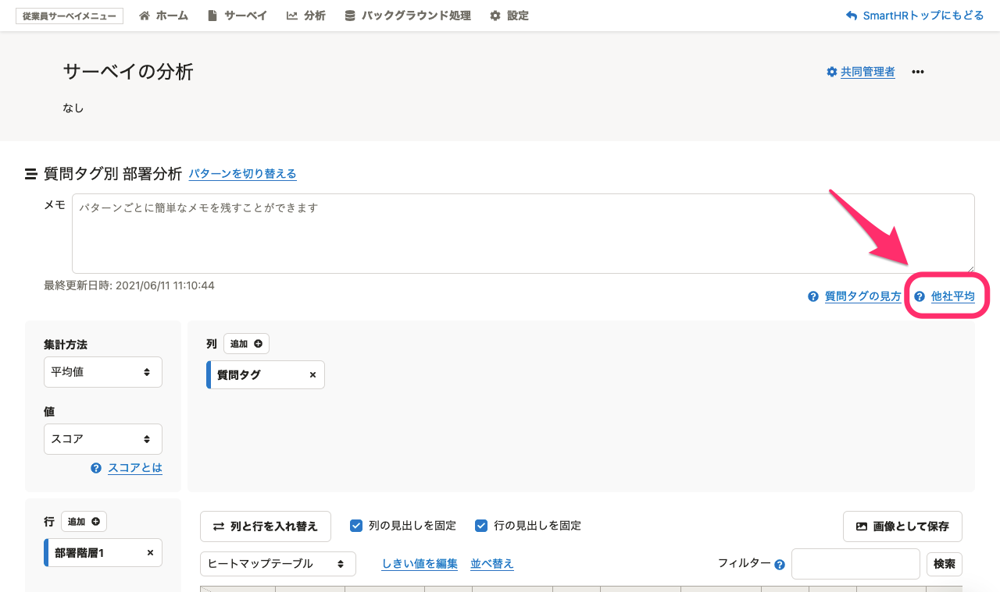

2021年9月6日（月）〜10日（金）に行なったアップデートの詳細をお知らせします。

従業員サーベイ機能の変更点は、カイゼン2件でした。

# 📈 カイゼン

## エンゲージメントサーベイ以外のプリセットサーベイの質問内容を変更できるようにしました

これまでは、新入社員サーベイなどのプリセットサーベイは、質問の追加・複製・削除のみができ、質問内容の変更はできませんでした。

そのため、質問内容を変更する場合は、質問を複製し内容を変更したあと、元の質問を削除するという手順が必要でした。

今回のリリースでは、質問内容を変更できるようにし、自社の運用に合わせたサーベイを作成しやすくしました。

| 変更前 | 変更後 |
| --- | --- |
|  |  |

:::alert
なお、エンゲージメントサーベイは、引き続き質問内容の変更はできません。エンゲージメントサーベイは、慶應義塾大学商学部 山本勲教授と共同研究を行ない、従業員のエンゲージメントを統計的に有意に取得できるように質問を設計しているためです。
:::

## リニューアル後のエンゲージメントサーベイの他社平均を見れるようにしました

リニューアルに伴い、非表示にしていたリニューアル後のエンゲージメントサーベイの他社平均を見れるようにしました。

:::related
[2021/05/27-06/02 エンゲージメントサーベイをリニューアルしました 他1件](https://knowledge.smarthr.jp/hc/ja/articles/900007765103)
:::

あわせて、下記の修正も行ないました。

- 他社平均の表のレイアウトを見やすい形式に変更
- 他社平均の表示速度をカイゼン

他社平均は、エンゲージメントサーベイの分析画面の **［他社平均］** から確認できます。

