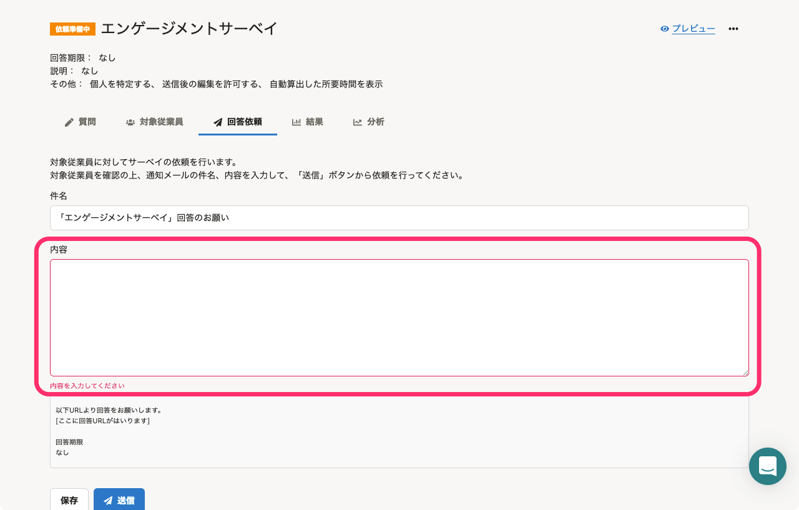
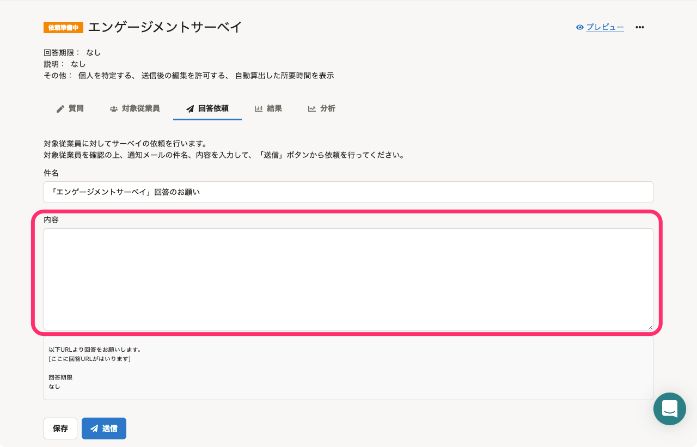

2021年9月20日（月）〜24日（金）に行なったアップデートの詳細をお知らせします。

従業員サーベイ機能の変更点は、カイゼン1件・不具合修正1件でした。

# 📈 カイゼン

## サーベイの回答依頼画面を開いた際に表示していたエラーを表示しないようにしました

これまでは、回答依頼画面を開いた時点で **［件名］** や **［内容］** が未入力のエラーメッセージが表示されていました。

今回のリリースで、画面を開いた時点ではエラーメッセージを表示せず、文字列を削除するなどして **［内容］** が空になったときや、 **［送信］** をクリックしたときにエラーを出すようにしました。

| 変更前 | 変更後 |
| --- | --- |
|  |  |

# 👨‍⚕️ 不具合修正

入力フォームの表示に関する1件の不具合修正を行いました。
