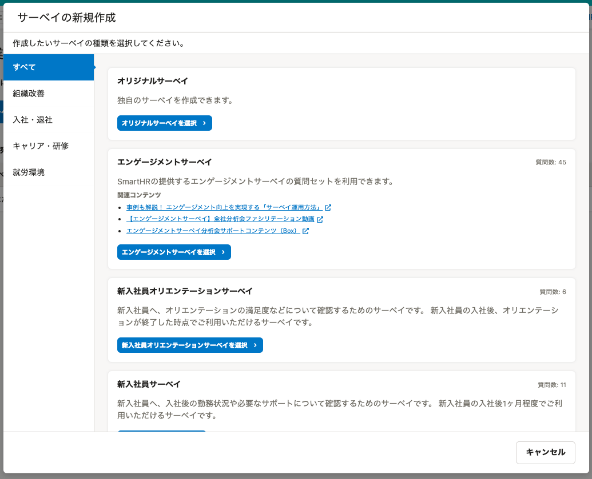
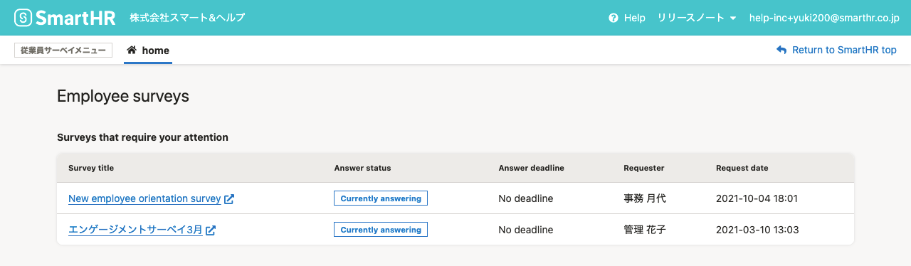
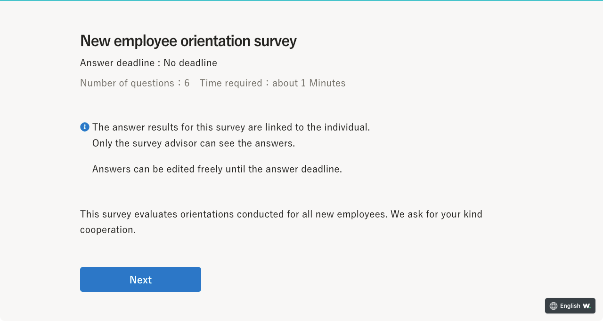
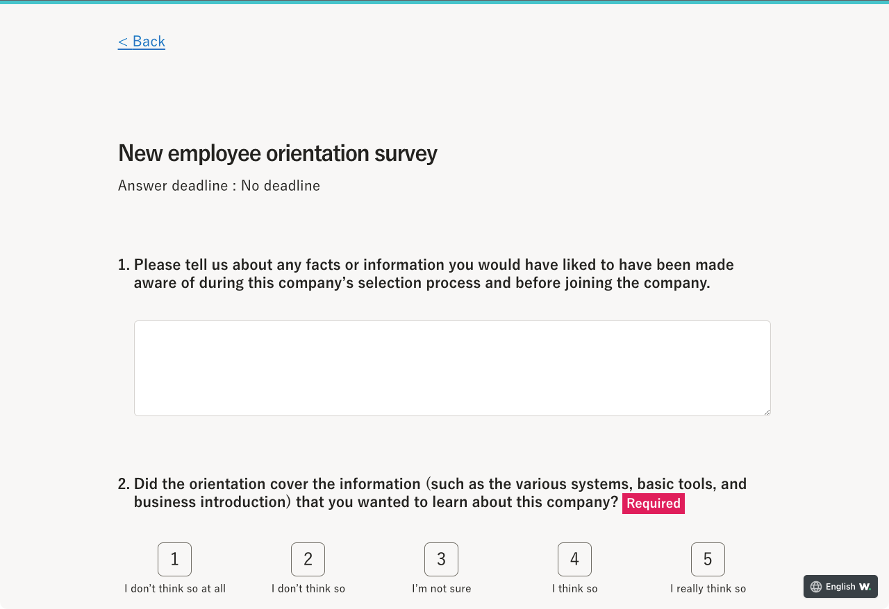

2021年9月27日（月）〜10月1日（金）に行なったアップデートの詳細をお知らせします。

従業員サーベイ機能の変更点は、新機能2件・不具合修正1件でした。

# ✨新機能

## プリセットサーベイを5種類追加しました

さまざまな用途ですぐにサーベイを実施できるように、下記の5つのプリセットサーベイを追加しました。

- 退職サーベイ
- キャリアサーベイ
- 研修感想サーベイ
- ハラスメントサーベイ
- テレワークサーベイ

また、サーベイの新規作成ダイアログのデザインを変更し、調査したい内容からサーベイを選択できるようにしました。

下記のお知らせもあわせてご覧ください。

[【従業員サーベイ】プリセットサーベイの種類を増やしました](https://smarthr.jp/update/28723)

:::related
[プリセットサーベイを利用する](https://knowledge.smarthr.jp/hc/ja/articles/360054477074)
:::

## 従業員向けの画面と一部のプリセットサーベイの説明と質問を多言語対応しました

下記の箇所の多言語対応を行ないました。

- ホーム画面などの従業員向け画面
- 下記のプリセットサーベイの説明文・質問文
    - エンゲージメントサーベイ
    - 新入社員オリエンテーションサーベイ
    - 新入社員サーベイ
    - 新入社員に関するサーベイ
    - 年末調整に関するサーベイ

ホーム画面

サーベイ回答画面

なお、下記のプリセットサーベイも順次対応する予定です。

- 退職サーベイ
- キャリアサーベイ
- 研修感想サーベイ
- ハラスメントサーベイ
- テレワークサーベイ

:::related
[多言語化対応について](https://knowledge.smarthr.jp/hc/ja/articles/360035659594)
[多言語表示が正しく表示されない場合の対応方法は？](https://knowledge.smarthr.jp/hc/ja/articles/360056003974)
::::::alert
オリジナルサーベイは多言語対応していません。オリジナルサーベイを翻訳したい場合は、お客さま自身で翻訳を準備してください。
[Q. オリジナルサーベイを翻訳して配信したい場合は？](https://knowledge.smarthr.jp/hc/ja/articles/4404834328857)
:::

# 👨‍⚕️ 不具合修正

ホーム画面に関する1件の不具合修正を行ないました。
