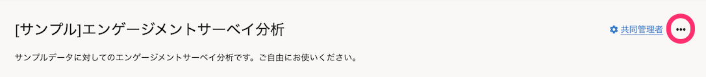

2021年10月4日（月）〜8日（金）に行なったアップデートの詳細をお知らせします。

従業員サーベイ機能の変更点は、カイゼン2件・不具合修正1件でした。

# 📈 カイゼン

## サーベイと分析の操作メニューボタンのデザインを変更しました

これまでは、サーベイと分析の操作メニューボタンは **［…］** という表示で、目立たず、何ができるボタンかが伝わりづらいものでした。

今回のリリースで、[SmartHR Design Systemの複数の操作をまとめるボタン](https://smarthr.design/products/design-guide/dropdown-button/)にあわせて、それぞれ **［サーベイの操作］［分析の操作］** という文言に変更し、デザインも変更しました。

あわせて、サーベイと分析の詳細画面・一覧画面のレイアウトを見やすく調整しました。

- サーベイ画面

| 変更前 |  |
| --- | --- |
| 変更後 |  |

- 分析画面

| 変更前 |  |
| --- | --- |
| 変更後 |  |

## サーベイの新規作成ダイアログで、匿名で実施するサーベイを示すアイコンのデザインを変更しました

これまでは、匿名で実施するサーベイには **［？］** アイコンと **［匿名］** という文言が表示されていましたが、アイコンがヘルプページへのリンクアイコンと同じで、何を表しているのかわかりづらいものでした。

今回のリリースで、 **［匿名で実施］** という文言に変更し、匿名で実施されることを明記しました。

| 変更前 |  |
| --- | --- |
| 変更後 |  |

# 👨‍⚕️ 不具合修正

プリセットサーベイの所要時間の表示に関する1件の不具合修正を行ないました。
