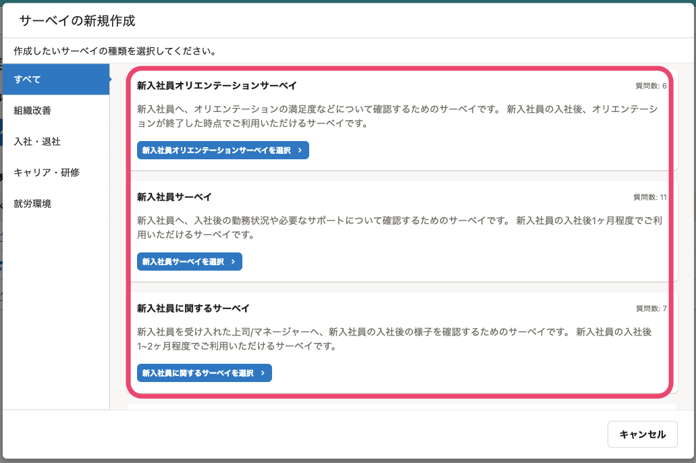
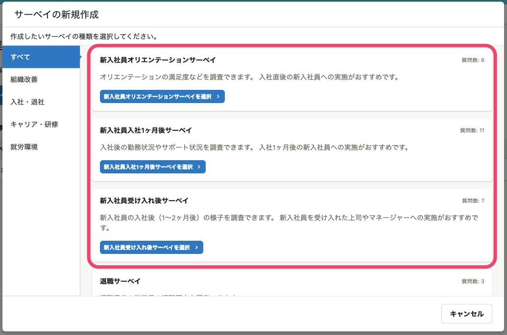
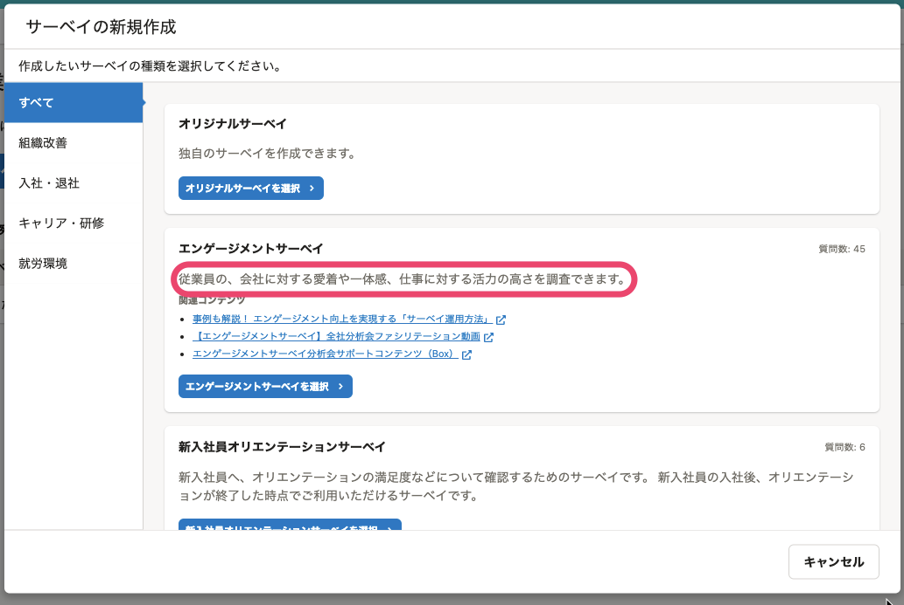
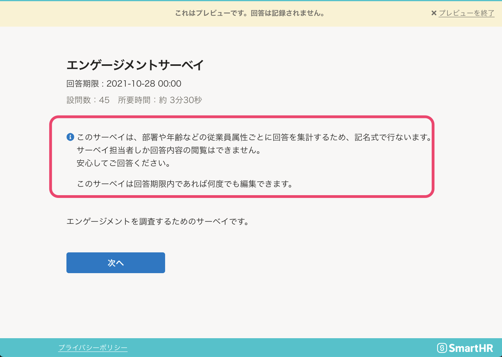
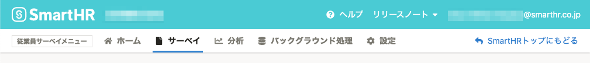
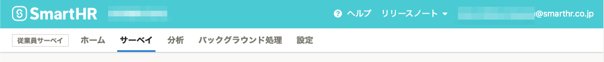

2021年10月18日（月）〜22日（金）に行なったアップデートの詳細をお知らせします。

従業員サーベイ機能の変更点は、カイゼン5件・不具合修正1件でした。

# 📈 カイゼン

## 入社に関するプリセットサーベイのタイトルと説明文を変更しました

これまでは、入社に関する3種のサーベイ（新入社員オリエンテーションサーベイ、新入社員サーベイ、新入社員に関するサーベイ）のタイトルが紛らわしく、いつ、誰に実施するサーベイかがわかりづらいものでした。

そこで、今回のリリースで、サーベイのタイトルと説明文を変更しました。

- サーベイのタイトル
    - 新入社員サーベイ→新入社員入社1ヶ月後サーベイ
    - 新入社員に関するサーベイ→新入社員受け入れ後サーベイ

| 変更前 | 変更後 |
| --- | --- |
|  |  |

:::tips
- 質問内容は変更していないので、引き続き過去のサーベイからの推移は分析できます。
- 新入社員サーベイ、新入社員に関するサーベイのタイトルのみ、一時的に翻訳が解除されています。
:::

## エンゲージメントサーベイの説明文を変更しました

エンゲージメントサーベイの利用用途が伝わりやすい説明文に変更しました。

- 変更前：SmartHRの提供するエンゲージメントサーベイの質問セットを利用できます。
- 変更後：従業員の、会社に対する愛着や一体感、仕事に対する活力の高さを調査できます。

## 匿名で実施しないサーベイの回答トップ画面の表現を変更しました

サーベイの回答トップに表示される匿名で実施しないサーベイの説明文の表現が強く、「回答する従業員が不安になる。」という声をいただいていました。

今回のカイゼンで、記名式で実施する理由を記載し、安心して回答してもらえる表現に変更しました。

- 変更前：このサーベイの回答結果は個人と紐付けて扱われます。
- 変更後：このサーベイは、部署や年齢などの従業員属性ごとに回答を集計するため、記名式で行ないます。

## 権限を付与できるアカウントの上限を200に変更しました

従業員サーベイの権限を付与できるアカウント数を100から200に変更しました。

## ナビゲーションバーのデザインを変更しました

ナビゲーションバーから冗長な表現をなくすために、以下の変更をしました。

- メニューの項目のアイコンを削除しました。
- メニューをボタン形式からリンク形式に変更し、別タブで開きやすくしました。
- SmartHRのロゴと同じ動作をする **［SmartHRトップにもどる］** リンクを削除しました。
-  **［従業員サーベイメニュー］** を **［従業員サーベイ］** に変更しました。

| 変更前 |  |
| --- | --- |
| 変更後 |  |

# 👨‍⚕️ 不具合修正

サーベイの回答画面の表示に関する1件の不具合修正を行ないました。
