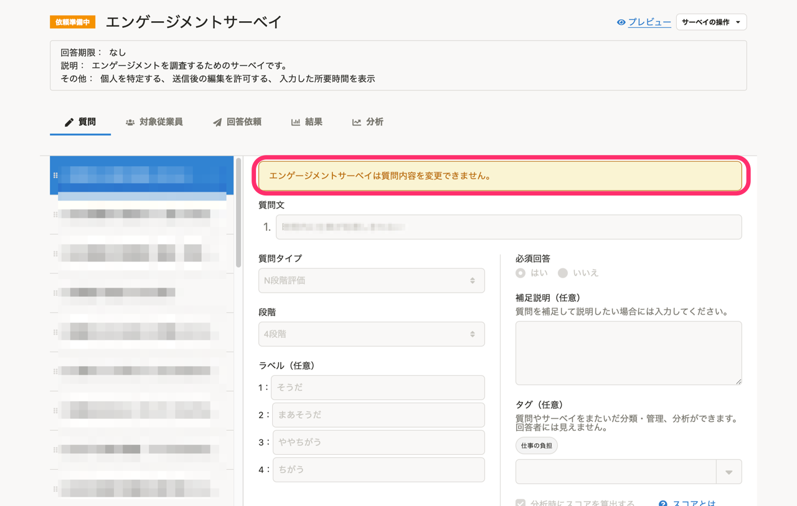
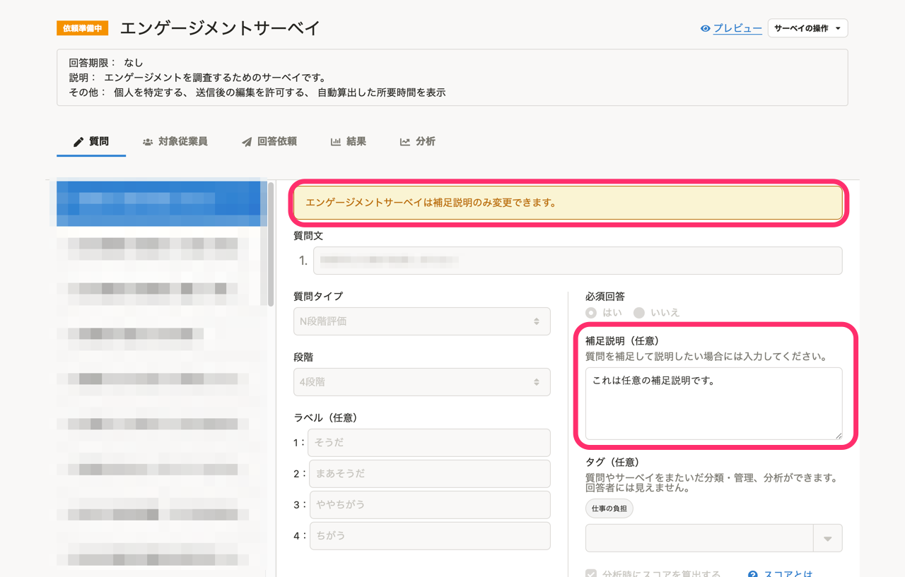
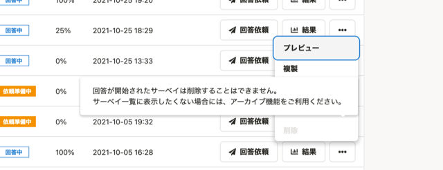
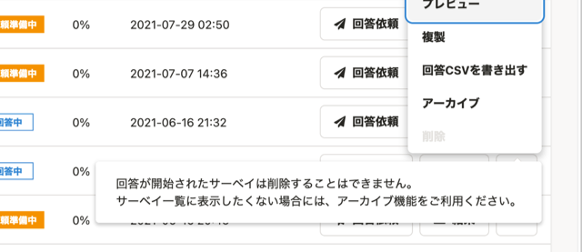

2021年10月25日（月）〜29日（金）に行なったアップデートの詳細をお知らせします。

従業員サーベイ機能の変更点は、カイゼン2件でした。

# 📈 カイゼン

## エンゲージメントサーベイの質問の［補足説明］を編集できるようにしました

これまでは、エンゲージメントサーベイはすべての質問内容を編集できませんでしたが、今回のアップデートで、 **［補足説明］** を編集できるようにしました。

これにより、質問で使われている言葉を補足したり、質問の意図をより正確に伝えたりできるようになりました。

| 変更前 | 変更後 |
| --- | --- |
|  |  |

## サーベイを削除できないことを伝えるメッセージが他のメニューに被らないようにしました

これまでは、サーベイ一覧画面で削除できないサーベイの **［削除］** にカーソルをあわせると表示されるメッセージが、他のメニューの上に表示され、操作しづらくなっていました。

今回のリリースで、メッセージが他のメニューに被らないようにしました。

| 変更前 | 変更後 |
| --- | --- |
|  |  |
