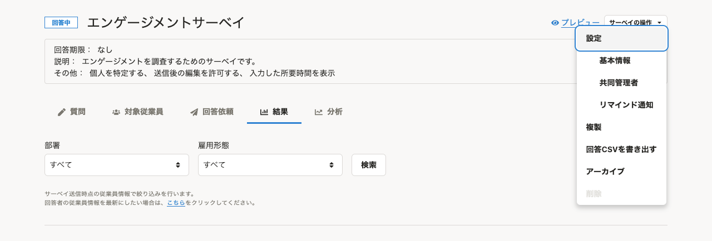
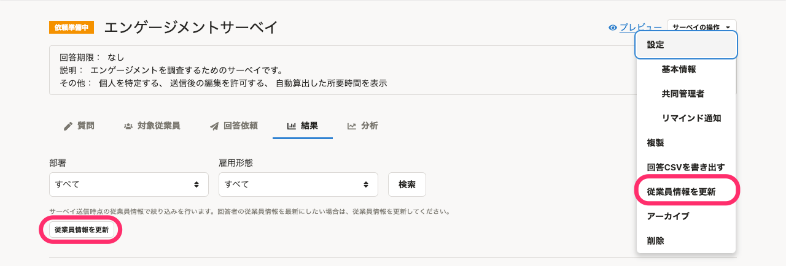

2021年11月1日（月）〜4日（金）に行なったアップデートの詳細をお知らせします。

従業員サーベイ機能の変更点は、カイゼン2件でした。

# 📈 カイゼン

## ［サーベイの操作］メニューから従業員情報を更新できるようにしました

これまでは、従業員情報に変更があった場合に、サーベイに使用する従業員情報を更新するには、サーベイの結果画面のテキストリンクをクリックする必要がありました。

結果画面からしか更新できず、またテキストリンクも目立たないため、わかりづらいという声をいただいていました。

そこで、今回のリリースで、 **［サーベイの操作］** メニューに **［従業員情報を更新］** を追加し、結果画面以外でも従業員情報を更新できるようにしました。

あわせて、結果画面にも **［従業員情報を更新］** ボタンを設置し、わかりやすいデザインにしました。

| 変更前 | 変更後 |
| --- | --- |
|  |  |

## 従業員情報の項目名をSmartHR基本機能にあわせて変更しました

従業員サーベイ機能で表示される従業員情報の項目名を、SmartHR基本機能にあわせて下記のとおり変更しました。

2021年10月12日（火）にSmartHR基本機能で実施されたカイゼンに沿った修正です。

| 変更前 | 変更後 |
| --- | --- |
| 入社日 | 入社年月日 |
| 所属事業所 | 事業所 |
| 住所 | 現住所 |
| 住所（ヨミガナ） | 現住所（ヨミガナ） |
| 住所（国コード） | 現住所（国コード） |
| 住所（郵便番号） | 現住所（郵便番号） |
| 住所（都道府県） | 現住所（都道府県） |
| 住所（市区町村） | 現住所（市区町村） |
| 住所（丁目・番地） | 現住所（丁目・番地） |
| 住所（建物名・部屋番号） | 現住所（建物名・部屋番号） |
| 性別 | 戸籍上の性別 |

:::related
[2021/10/12 従業員情報・家族情報に［障害者手帳の種類］と［障害者手帳の交付年月日］の項目を追加し、一部の項目名を変更しました](https://knowledge.smarthr.jp/hc/ja/articles/4407754249497)
:::
