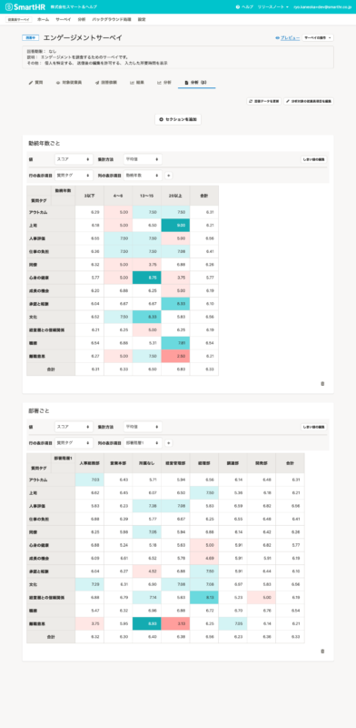
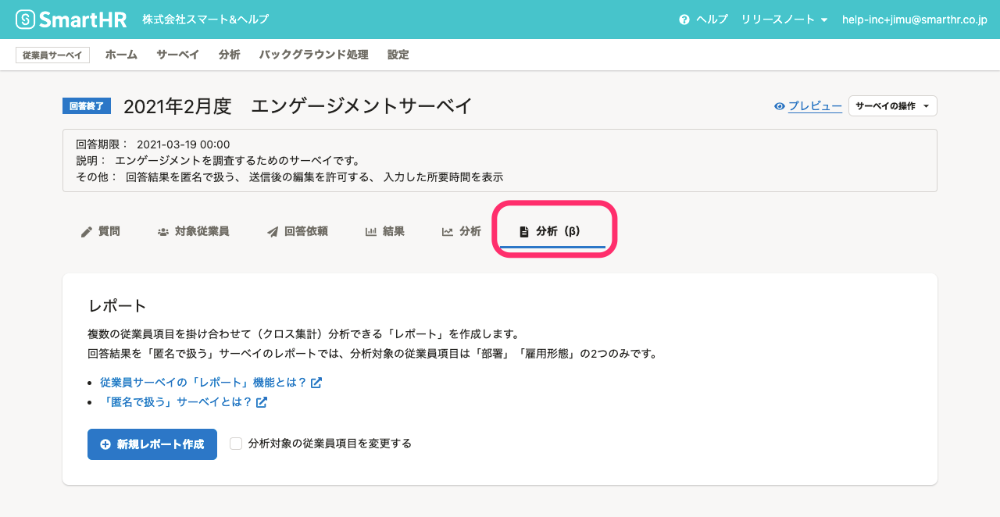

2021年11月15日（月）に行なったアップデートの詳細をお知らせします。

従業員サーベイ機能の変更点は、新機能1件でした。

# ✨新機能

## レポート機能をリリースしました

複数の従業員項目を掛け合わせて分析（クロス集計）できるレポート機能をリリースしました。

細かい設定なしに、クロス集計が作成できます。

レポート機能は、サーベイの **［分析（β）］** タブから利用できます。

詳しくは、下記のお知らせをご覧ください。

[【従業員サーベイ】レポート機能を公開しました](https://smarthr.jp/update/30267)

:::related
[従業員サーベイの「レポート」機能とは？](https://knowledge.smarthr.jp/hc/ja/articles/4406859458457)
:::
