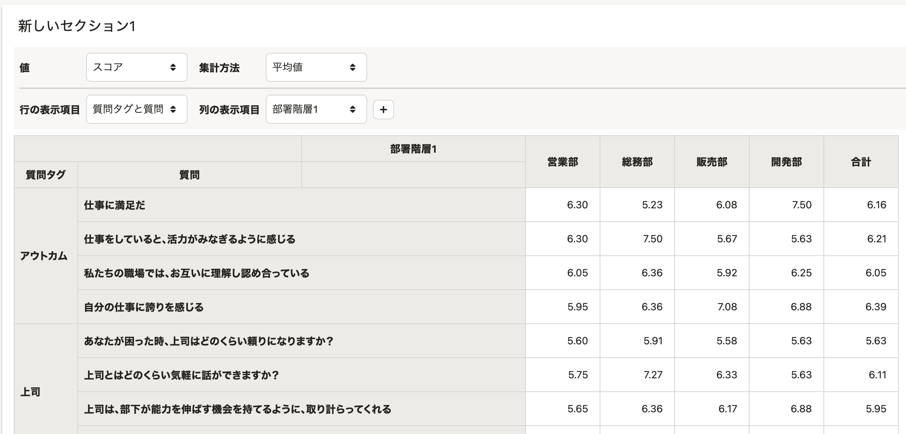

2021年11月16日（火）〜19日（金）に行なったアップデートの詳細をお知らせします。

従業員サーベイ機能の変更点は、改善2件でした。

# 📈 改善

## レポートの［行の表示項目］の選択肢に［質問タグと質問］、［質問と回答］を追加しました

これまでは、レポートのセクションの **［行の表示項目］** では、 **［質問］** 、 **［質問タグ］** のみ選択できました。

今回のアップデートで、 **［質問タグと質問］** 、 **［質問と回答］** を追加し、質問タグごとに質問をまとめて表示したり、質問とその回答を並べて表示したりできるようにしました。

ラジオボタンやチェックボックスの質問をより見やすく表示するための改善です。

 **［質問タグと質問］を選択したときの表示** 

****

## 共同管理者やリマインド通知の設定を保存した際に、設定ダイアログを閉じるようにしました

これまでは、サーベイの共同管理者やリマインド通知の設定を保存しても、ダイアログが閉じなかったため、本当に保存できたのかが伝わりづらくなっていました。

今回のアップデートで、 **［保存］** ボタンをクリックしたあとにダイアログが閉じるようにし、操作が完了したことをわかりやすくしました。
