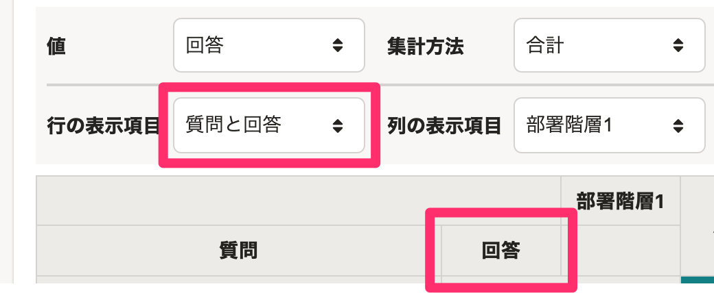
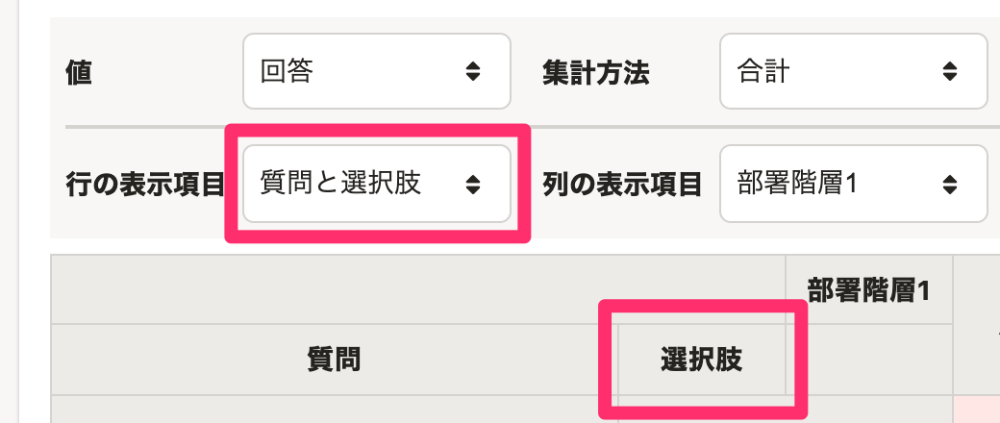
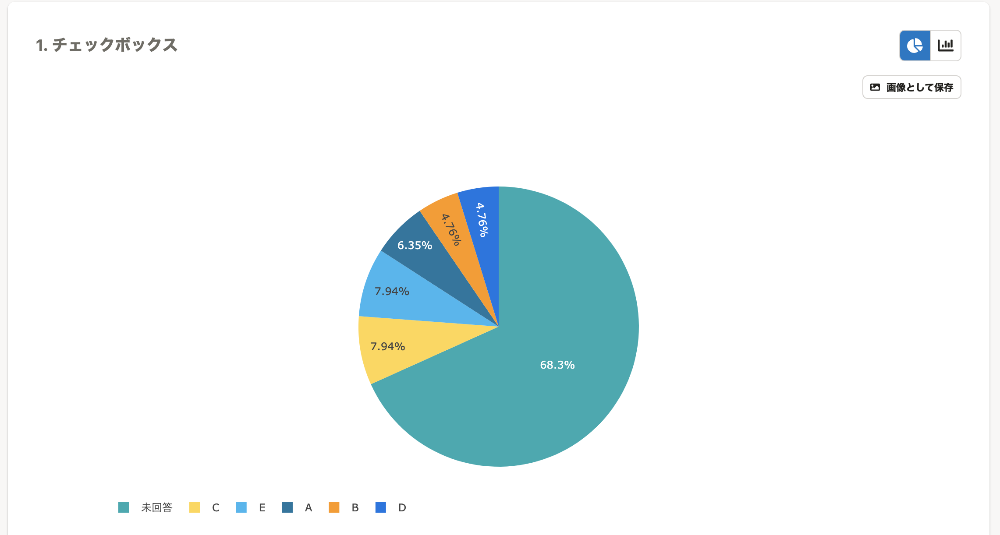
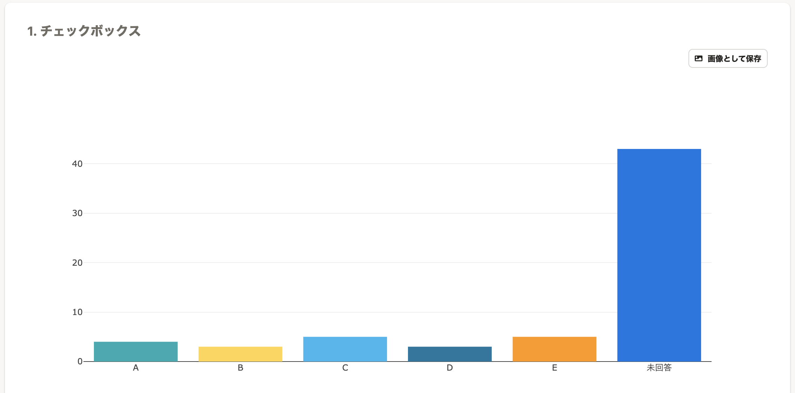

2021年12月6日（月）〜10日（金）に行なったアップデートの詳細をお知らせします。

従業員サーベイ機能の変更点は、改善5件・アクセシビリティ1件・不具合修正2件でした。

# 📈 改善

## プリセットサーベイがすべて多言語対応しました

プリセットサーベイの案内文・質問文がすべて多言語対応しました。

また、一時的に翻訳が解除されていた新入社員関連のサーベイのタイトルについても多言語対応しました。

## 未ログインの状態で従業員サーベイのURLにアクセスした際に、企業のサブドメインつきのURLに遷移するようにしました

これまでは、SmartHRにログインしていない状態で、従業員サーベイのURLにアクセスすると、共通のログイン画面（app.smarthr.jp）に遷移していました。

この仕様では、社員番号アカウントがログインできないため、今回のアップデートで企業専用のログイン画面に遷移するようにしました。

## レポートの行の表示項目の［質問と回答］を［質問と選択肢］に変更しました

これまでは、「回答」という表現だったため、ラジオボタンやチェックボックスの質問の選択肢を指していることがわかりづらくなっていました。

今回のリリースで「選択肢」に変更することで、直感的にわかりやすい表現にしました。

| 変更前 | 変更後 |
| --- | --- |
|  |  |

## 結果画面でチェックボックスの質問は棒グラフ表示のみにしました

これまでは、チェックボックス（複数選択）の質問でも円グラフで表示できていましたが、複数選択の質問の表示には円グラフは適切ではありませんでした。

今回のリリースで、チェックボックスの質問は棒グラフのみで表示するようにし、結果をひと目でわかりやすくしました。

| 変更前 | 変更後 |
| --- | --- |
|  |  |

## サーベイの質問作成画面のエラーの表示タイミングを変更しました

これまでは、サーベイの質問追加時や選択肢の追加時に、エラーが表示されていました。

今回のリリースで、 **［保存］** をクリックした際にエラーが表示されるようにし、質問の作成に集中できるようにしました。

# 🎢 アクセシビリティ

## フォントの指定をSmartHR基本機能にあわせて変更しました

これまでは、従業員サーベイは独自にフォントを設定していましたが、SmartHR基本機能にあわせて変更しました。

:::related
[5月22日（金）からSmartHR の書体（フォント）が変わります](https://smarthr.jp/update/18172)
[タイポグラフィ｜SmartHR Design System](https://smarthr.design/products/design-tokens/typography/)
:::

# 👨‍⚕️ 不具合修正

## レポートから自由記述の質問を除外しました

これまでは、自由記述を含むサーベイのレポートを作成し、 **［列の表示項目］** に **［回答］** を表示すると、セクションの表示が崩れ正しく分析できませんでした。

今回のリリースで、レポートから自由記述の質問を除外し、分析しやすくしました。

他、レポート作成時の表示に関する不具合修正を行ないました。
