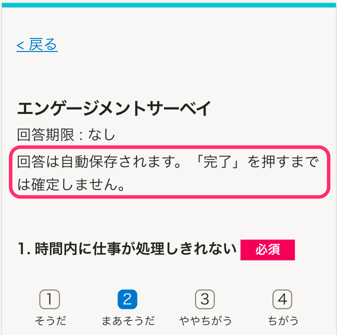

2022年1月4日（火）に行なったアップデートの詳細をお知らせします。

従業員サーベイ機能の変更点は、改善1件でした。

# 📈 改善

## サーベイの回答画面で「自動保存しました」のメッセージを表示しないようにしました

これまでの回答画面では、回答を入力するたびに画面左下に「自動保存しました」のメッセージが表示されていました。

これに対し、スマートフォンで利用している場合はメッセージが画面に被り、入力の妨げになるという声をいただいておりました。

そのため、今回のリリースで「自動保存しました」のメッセージを表示しないようにしました。

代わりに、回答画面の概要欄に回答が自動保存される旨の記載を追記しました。

