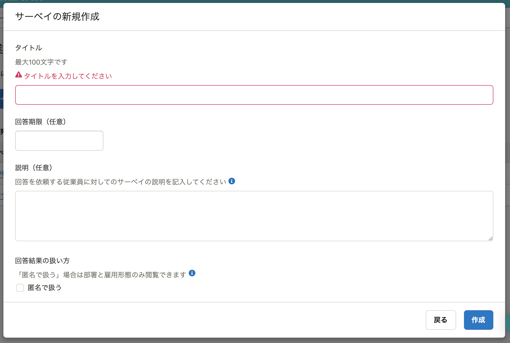

2022年1月5日（水）に行なったアップデートの詳細をお知らせします。

従業員サーベイ機能の変更点は、改善1件でした。

# 📈 改善

## ［サーベイの新規作成］ダイアログで、入力前にエラーが表示されないようにしました

これまでは、 **［サーベイの新規作成］** ダイアログを開いた際に、入力前にも関わらず必須項目に未入力のエラーが表示されていました。

今回のアップデートで、フォームに入力した際や、 **［作成］** をクリックした際にエラーが表示されるようにしました。

