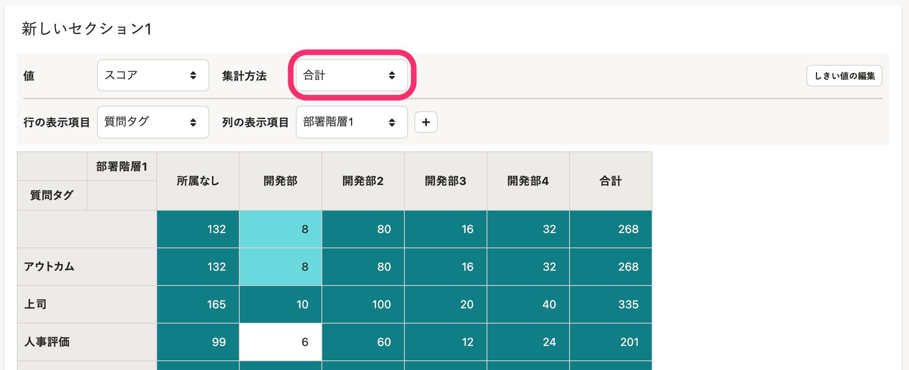
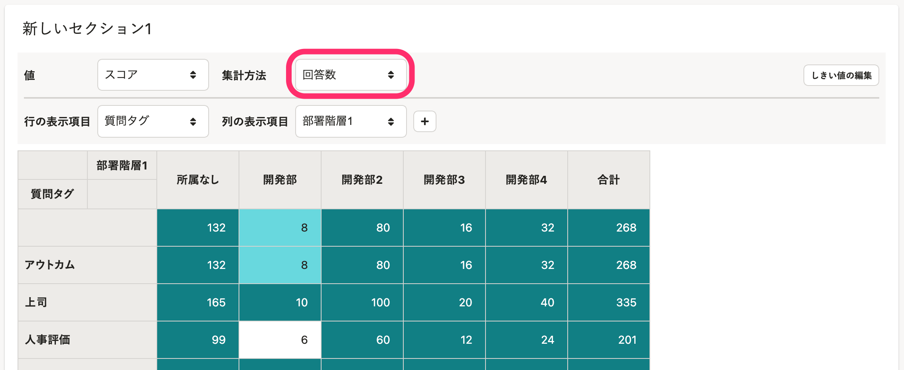
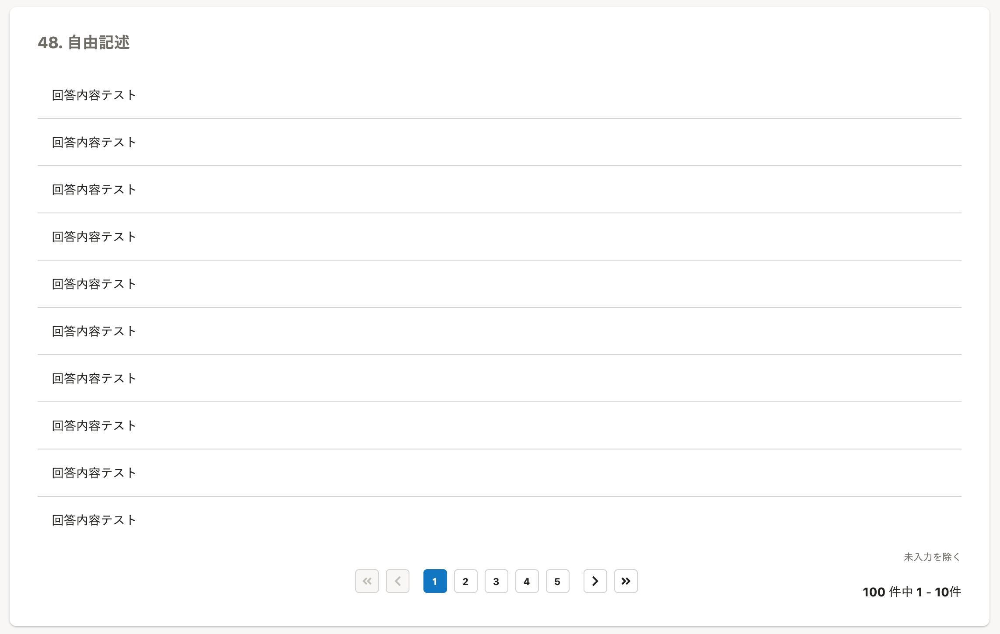
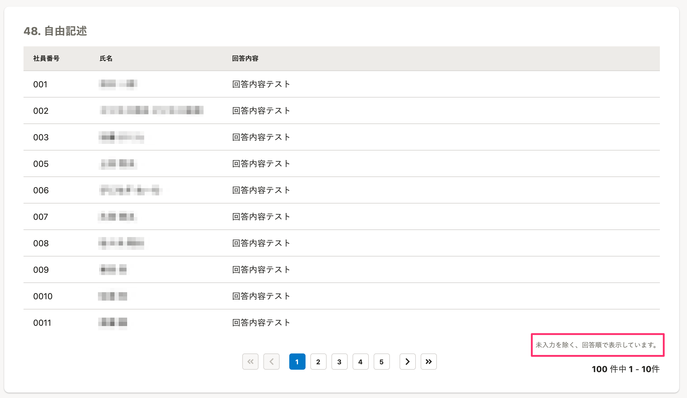
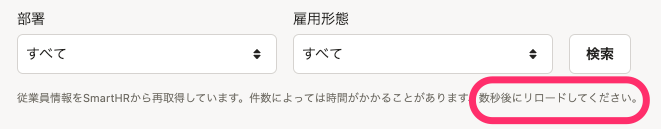
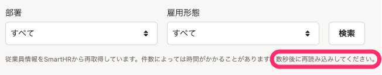

2022年1月7日（金）に行なったアップデートの詳細をお知らせします。

従業員サーベイ機能の変更点は、改善3件・不具合修正1件でした。

# 📈 改善

## 分析機能とレポート機能で、「合計」の表記を「回答数」に変更しました

これまでは、 **［集計方法］** の選択肢で **［合計］** という表現を使用していましたが、何を指しているのかが曖昧で伝わりづらくなっていました。

今回のリリースで、「回答の件数」であることが伝わるように **［回答数］** という表現に変更しました。

| 変更前 |  |
| --- | --- |
| 変更後 |  |

## 結果画面の自由記述の質問に社員番号と個人名を表示するようにしました

これまでは、結果画面では自由記述の質問は回答のみが表示されていたため、回答者を確認するには回答CSVをダウンロードする必要がありました。

今回のリリースで、結果画面に回答者の社員番号と個人名を表示をするようにしました。

なお、回答は最終回答順で表示されます。

| 変更前 |  |
| --- | --- |
| 変更後 |  |

## 「リロード」の表記を「再読み込み」に変更しました

SmartHR全体での表記ルールに合わせて、全体的に「リロード」の表記を「再読み込み」に変更しました。

| 変更前 |  |
| --- | --- |
| 変更後 |  |

# 👨‍⚕️ 不具合修正

アーカイブ済みのサーベイに関する1件の不具合修正を行ないました。
