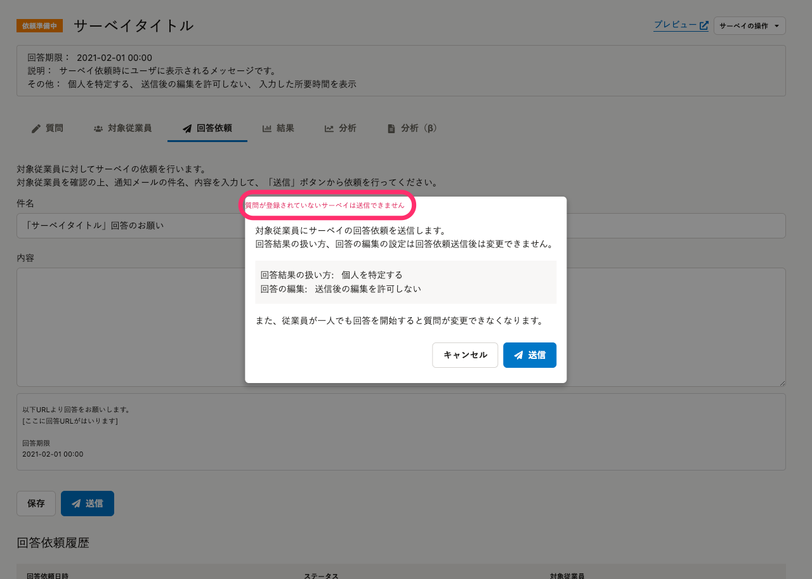
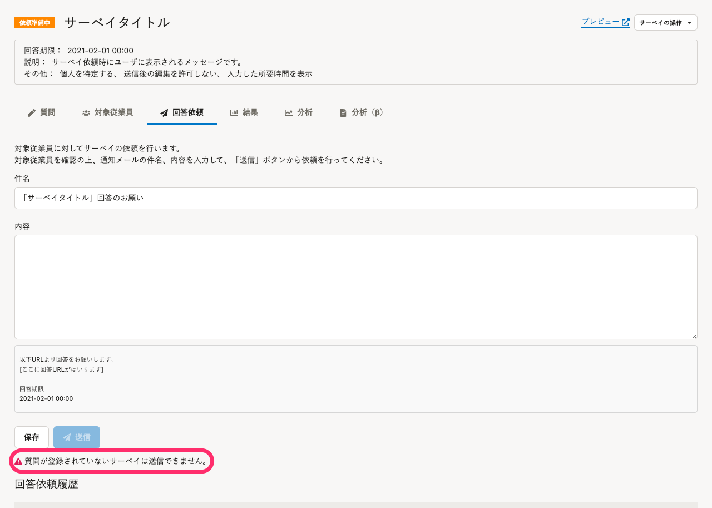

2022年1月20日（木）に行なったアップデートの詳細をお知らせします。

従業員サーベイ機能の変更点は、改善5件、不具合修正1件でした。

# 📈 改善

## サーベイの回答開始後でもサーベイを削除できるようにしました

これまでは、回答開始後のサーベイは削除できませんでした。

今回のリリースで、回答開始後でもあってもサーベイが削除できるようにしました。

また、サーベイを削除した場合はサーベイの回答データ、バックグラウンド処理のデータ、分析を含むすべてのデータが削除され、元に戻すことはできません。

## 質問の件数が0件サーベイの場合、依頼が送信できない旨のエラーの表示場所を変更しました

これまでは、質問が1件も登録されていないサーベイを送信しようとした際に、依頼送信ダイアログの中で依頼を送信できない旨のエラーメッセージを表示していました。

今回のリリースで、依頼送信画面で該当のエラーメッセージが表示されるようし、 **［送信］** のクリック前にエラーに気が付けるようにしました。

| 変更前 | 変更後 |
| --- | --- |
|  |  |

## 結果画面のグラフをスクロールで拡大／縮小する機能を削除しました

これまでは、スクロールで結果画面のグラフを拡大／縮小できましたが、意図しないタイミングで拡大／縮小してしまい、グラフが確認しづらくなることがありました。

今回のリリースで拡大／縮小機能を無効化し、結果の閲覧に集中できるようにしました。

## 回答画面ではお問い合わせアイコンを非表示にしました

これまでは、スマートフォンなどをお使いの場合に、お問い合わせアイコンが回答画面のボタンなどに被って操作しづらい場合がありました。

そのため、今回のリリースで回答画面ではお問い合わせアイコンを非表示にしました。

## サーベイの回答完了時に回答必須で未回答の質問がある場合、該当の質問の箇所に画面をスクロールするようにしました

これまでは、未回答の質問がある旨のエラーメッセージは表示されていましたが、どの質問が未回答なのかはスクロールして探す必要がありました。

今回のリリースで、 **［回答］** または **［回答を更新］** をクリックしたあとに未回答の質問の箇所に画面がスクロールするようにしました。

これにより、質問の数が多いサーベイでも未回答の質問がすぐにわかるようになりました。

# 👨‍⚕️ 不具合修正

サーベイ回答画面の自由記述の質問に関する1件の不具合修正を行ないました。
