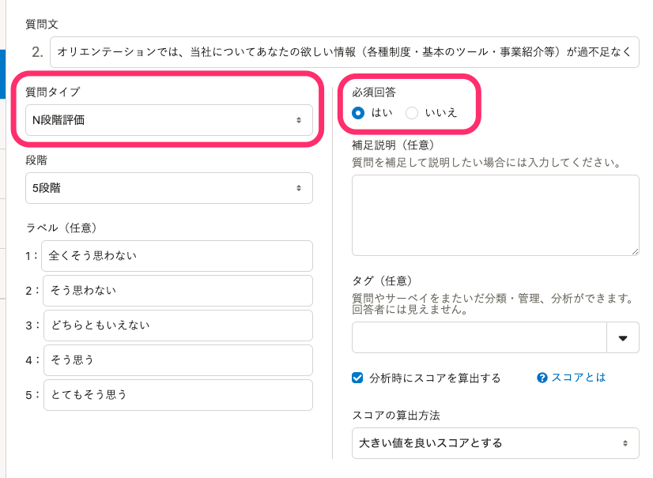
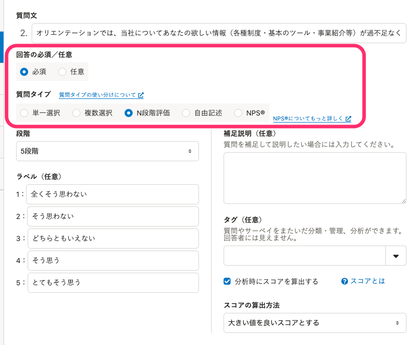

2022年1月26日（水）に行なったアップデートの詳細をお知らせします。

従業員サーベイ機能の変更点は、改善2件、不具合修正2件でした。

# 📈 改善

## 質問の編集フォームのデザインを変更しました

質問の編集をよりわかりやすくするために、質問の編集フォームの文言やデザインを変更しました。

主な変更点は下記のとおりです。

- 必須回答の設定項目の文言を変更
-  **［質問タイプ］** のUIを変更
-  **［質問タイプ］** の選択肢の順番と文言を変更
- 質問タイプを説明するヘルプページへのリンクを追加

| 変更前 | 変更後 |
| --- | --- |
|  |  |

:::related
[質問の種類と使い分け](https://knowledge.smarthr.jp/hc/ja/articles/4413826996377)
:::

## サーベイの回答完了時に回答必須で未回答の質問がある場合に表示されるエラーメッセージを非表示にしました

これまでは、回答画面で未回答の必須質問がある場合、完了ボタンを押した際に画面左下にエラーメッセージを表示していました。

これにより、スマートフォンなどで利用している場合に、他のボタンにメッセージか被り操作しづらくなっていたため、今回のリリースでメッセージを非表示にしました。

なお、2022年1月20日のリリースで、未回答の質問に画面をスクロールする改善を行ない、エラーメッセージがなくても未回答の質問に気が付けるようにしています。

:::related
[2022/01/20 サーベイの回答開始後でもサーベイを削除できるようにしました 他5件](https://knowledge.smarthr.jp/hc/ja/articles/4415632146713)
:::

# 👨‍⚕️ 不具合修正

サーベイ回答画面に関する修正など、2件の不具合修正を行ないました。
