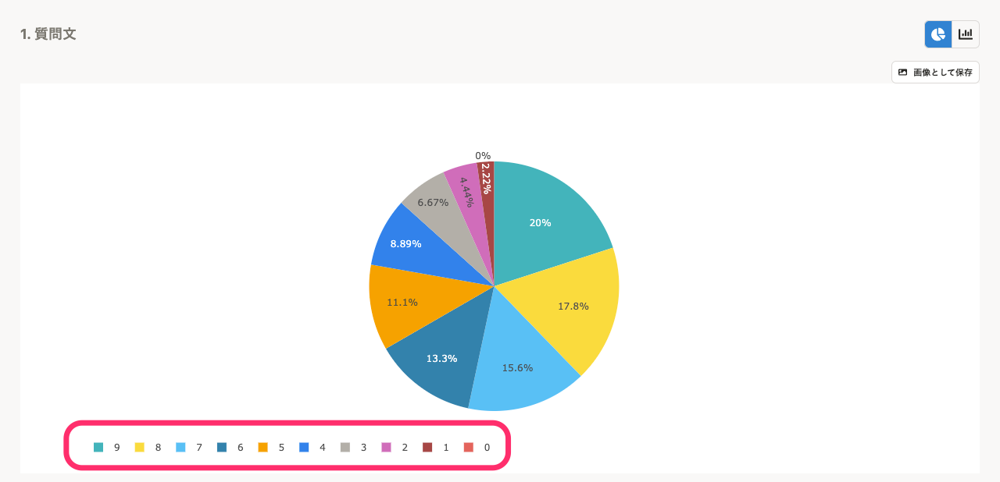
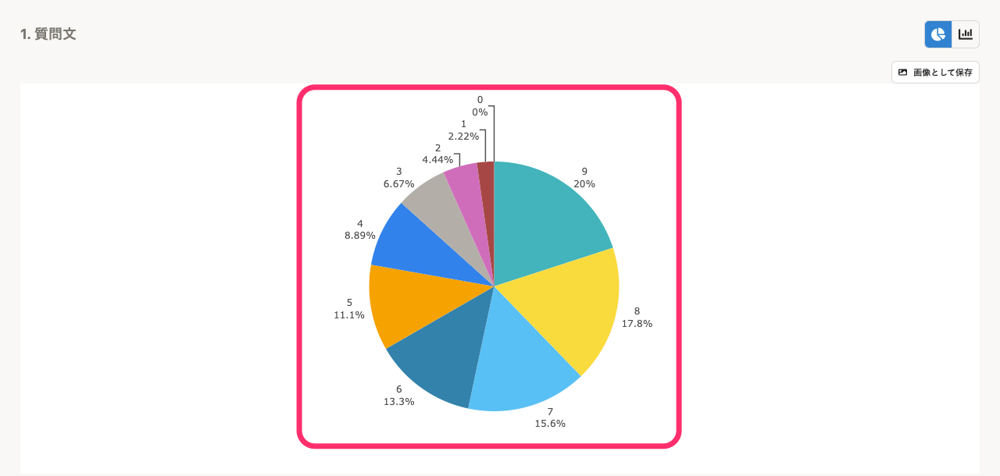
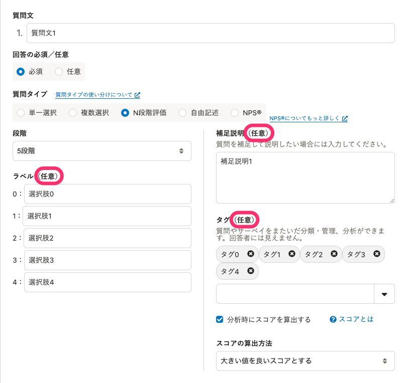
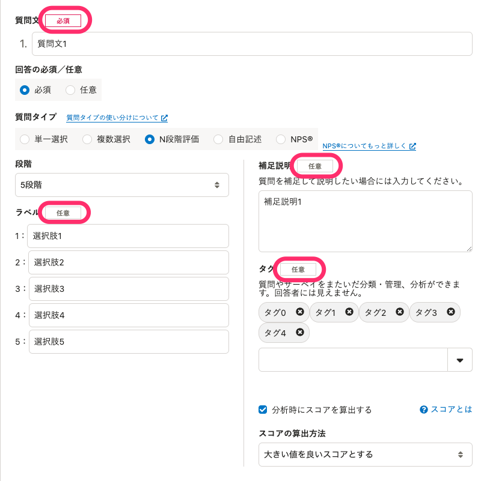

2022年1月27日（木）に行なったアップデートの詳細をお知らせします。

従業員サーベイ機能の変更点は、新機能1件、改善2件、不具合修正1件でした。

# ✨ 新機能

## プリセットサーベイを4種類追加しました

さまざまな用途ですぐにサーベイを実施できるように、下記の4つのプリセットサーベイを追加しました。

- 人事評価制度の理解度チェックサーベイ
- 【被評価者向け】人事評価制度の運用改善サーベイ
- 【評価者向け】人事評価制度の運用改善サーベイ
- マネジメントサーベイ

下記のお知らせもあわせてご覧ください。

[【従業員サーベイ】プリセットサーベイに評価関連のサーベイとマネジメントサーベイを追加しました](https://smarthr.jp/update/32465)

:::related
[プリセットサーベイを利用する](https://knowledge.smarthr.jp/hc/ja/articles/360054477074)
:::

# 📈 改善

## 結果画面のグラフの凡例の表示方法を改善しました

これまでは、結果画面のグラフの凡例は、選択肢とグラフの色が対応する形で左下に表示していましたが、グラフと凡例の対応がわかりづらくなっていました。

今回のリリースで、既存の凡例を非表示にし、グラフの近くに回答の選択肢名を表示しました。

| 変更前 | 変更後 |
| --- | --- |
|  |  |

## 質問の編集フォームの入力必須／任意の表示を改善しました

これまでは、 **［質問文］** に必須の表示がなく、質問を編集する際にどの項目が必須なのかをひと目で判断できませんでした。

今回のリリースで、 **［質問文］** に **［必須］** のラベルを追加し、あわせて **［任意］** のラベルのデザインも統一しました。

| 変更前 | 変更後 |
| --- | --- |
|  |  |

# 👨‍⚕️ 不具合修正

<>で囲った文字が通知メールの本文で非表示になる不具合を修正しました。
