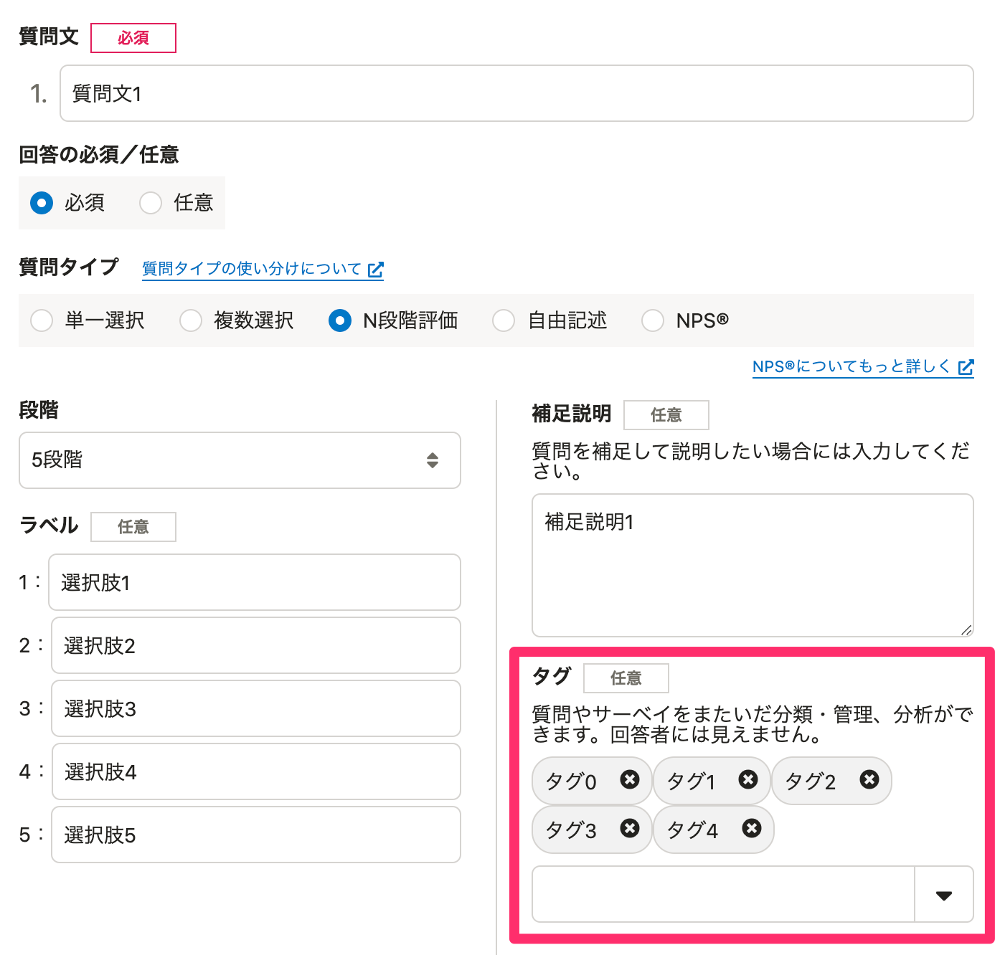
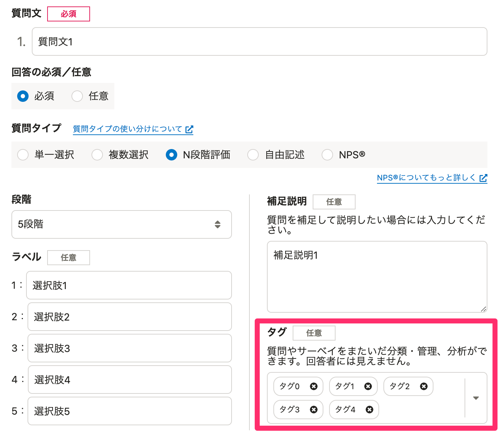

2022年2月7日（月）に行なったアップデートの詳細をお知らせします。

従業員サーベイ機能の変更点は、改善1件、アクセシビリティ1件、不具合修正1件でした。

# 📈 改善

## プリセットサーベイの場合、各サーベイに適した設定のレポートを作成するようにしました

これまでは、プリセットサーベイのレポートを作成した際に、分析対象の従業員項目や行列の表示項目などを、手動で設定する必要がありました。

今回のリリースで、プリセットサーベイのレポートの作成時は、サーベイに適した設定でレポートを作成するようにしました。

これにより、レポートやセクションの設定に試行錯誤せずに、すぐに結果を分析できます。

# 🎢 アクセシビリティ

## 質問編集画面のタグの設定をキーボードで操作しやすくしました

これまでは、タグの削除はキーボードで操作できませんでした。

今回のリリースで、タグの削除がキーボードで操作できるようにしました。

あわせてデザインも見やすくしました。

| 変更前 | 変更後 |
| --- | --- |
|  |  |

# 👨‍⚕️ 不具合修正

回答画面のアクセシビリティに関する1件の不具合修正を行ないました。
