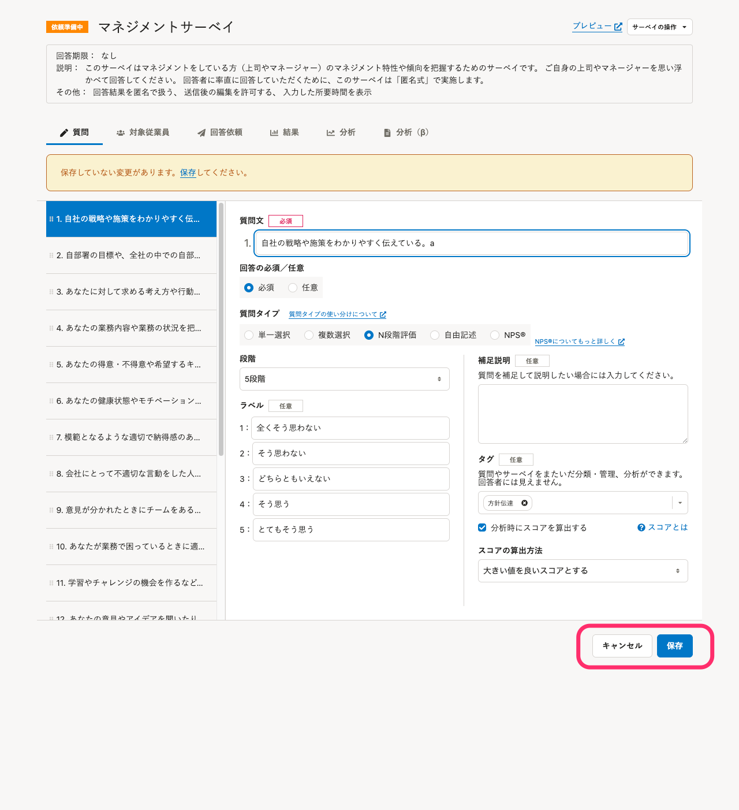
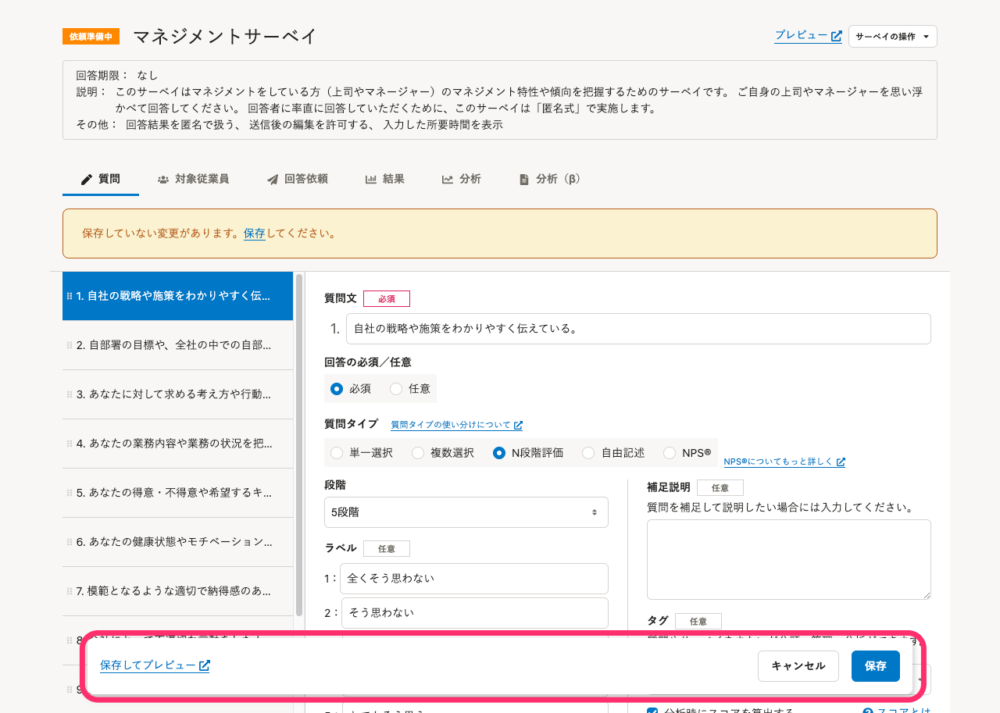

2022年2月14日（月）に行なったアップデートの詳細をお知らせします。

従業員サーベイ機能の変更点は、改善2件でした。

# 📈 改善

## 質問編集画面で保存ボタン・キャンセルボタンを常に表示するようにしました

これまでは、保存ボタンやキャンセルボタンがフォームの最下部に配置されていました。

このため、質問の選択肢が多い場合は、画面をスクロールしないとボタンを操作できませんでした。

今回のリリースで、これらのボタンを常に画面下部に表示するようにしました。

また、「保存してプレビュー」機能を追加し、保存と同時にプレビューを閲覧できるようにしました。

| 変更前 | 変更後 |
| --- | --- |
|  |  |

## 質問編集画面で、変更を保存せずに画面の再読み込みや移動をしようとすると、アラートが出るようにしました

これまでは、質問の編集画面で変更後に保存をせず、画面の再読み込みや移動をすると、変更内容が失われていました。

今回のリリースで、保存前の変更がある場合にはアラートを出すようにしました。

これにより、保存漏れに気付かず、別の画面へ移動して変更内容が失われるのを防げるようにしました。
