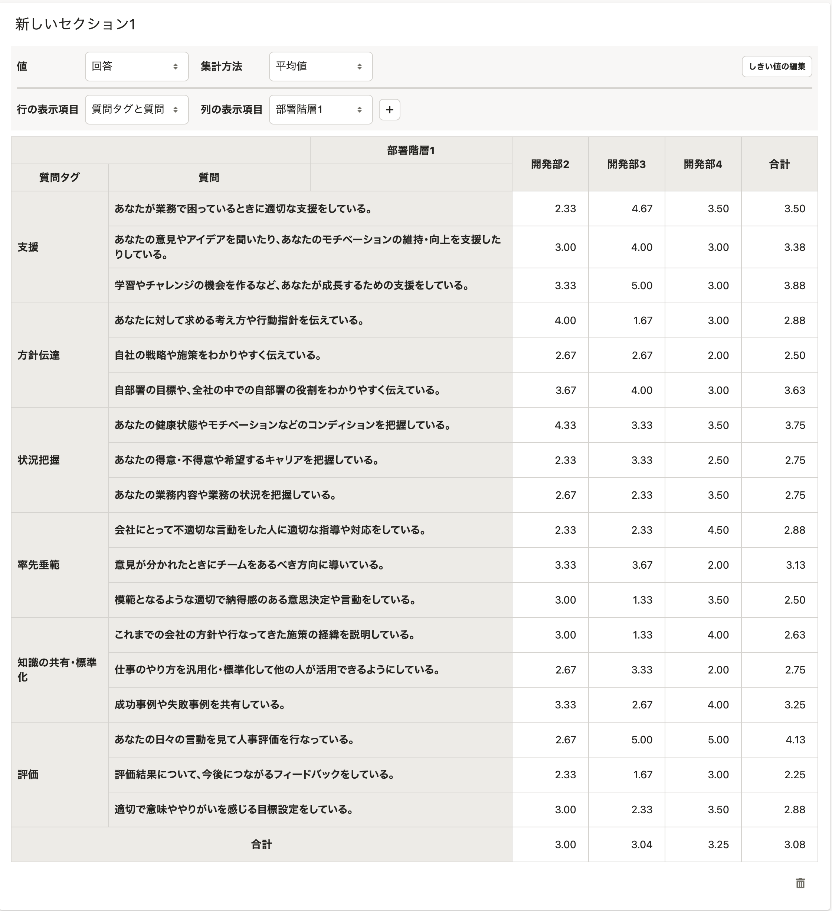
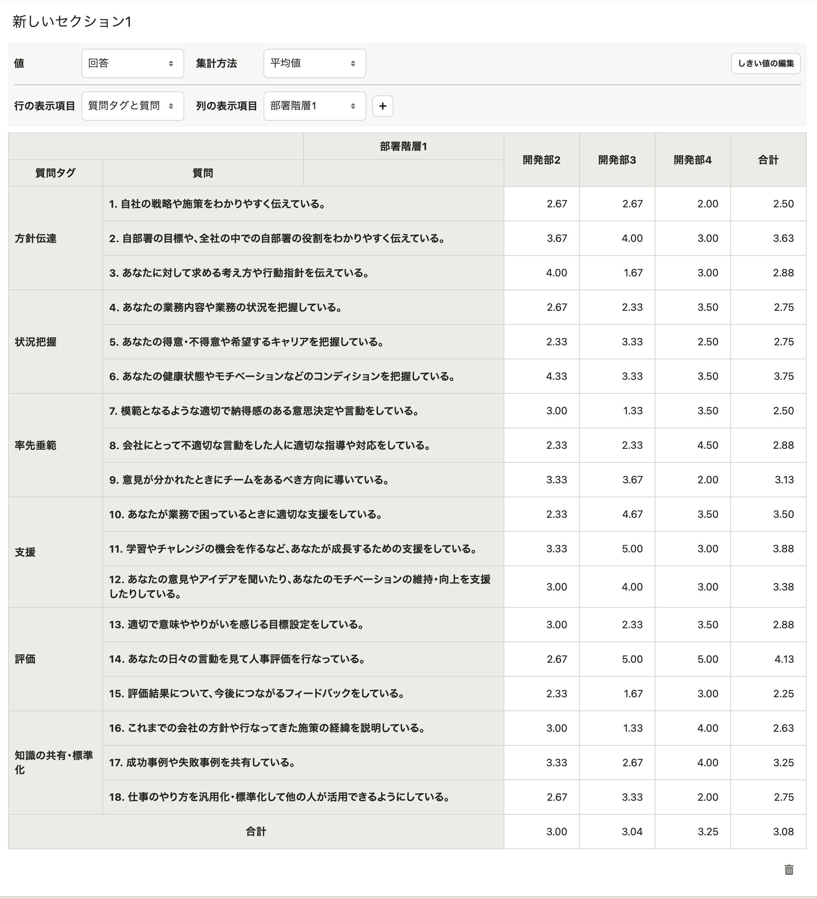

2022年2月17日（木）に行なったアップデートの詳細をお知らせします。

従業員サーベイ機能の変更点は、改善1件でした。

# 📈 改善

## レポートのセクションで、質問の表示順を質問番号順にしました

これまでは **［行の表示項目］** で **［質問タグと質問］** を選択していた場合、行の表示順が質問タグの文字コード順になっていたため、質問の作成時と表示順が異なることがありました。

今回のリリースで、質問番号順に **［質問タグ］** 列、 **［質問］** 列を表示するようにしました。

あわせて **［質問］** 列に質問番号を表示するようにしました。

すでに作成済みのレポートに今回の改善を反映するには、 **［回答データを更新］** または **［分析対象の従業員項目を編集］** を実行してください。

| 変更前 | 変更後 |
| --- | --- |
|  |  |
