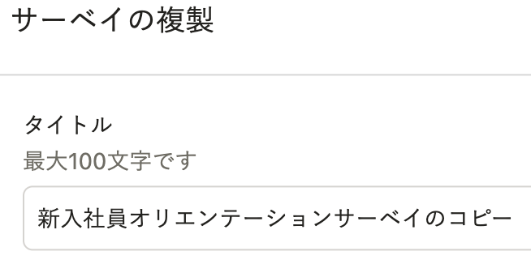
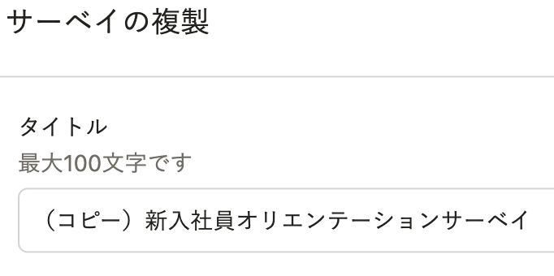

2022年3月9日（水）に行なったアップデートの詳細をお知らせします。

従業員サーベイ機能の変更点は、改善1件でした。

# 📈 改善

## サーベイや分析を複製した際、タイトルの先頭に「（コピー）」と記載するようにしました

これまでサーベイ・質問・分析を複製した場合は、新規作成分のタイトルが「（複製元のタイトル）のコピー」となっていました。

コピーである旨が末尾に記載されているため、タイトルが長い場合に見落とされる可能性がありました。

今回、SmartHR全体のガイドラインに合わせて、タイトルの先頭に「（コピー）」と記載するよう変更しました。

編集画面で「（コピー）」の文言を適宜削除して保存してください。

例：「新入社員オリエンテーションサーベイ」を複製した場合

| 変更前 | 変更後 |
| --- | --- |
|  |  |
