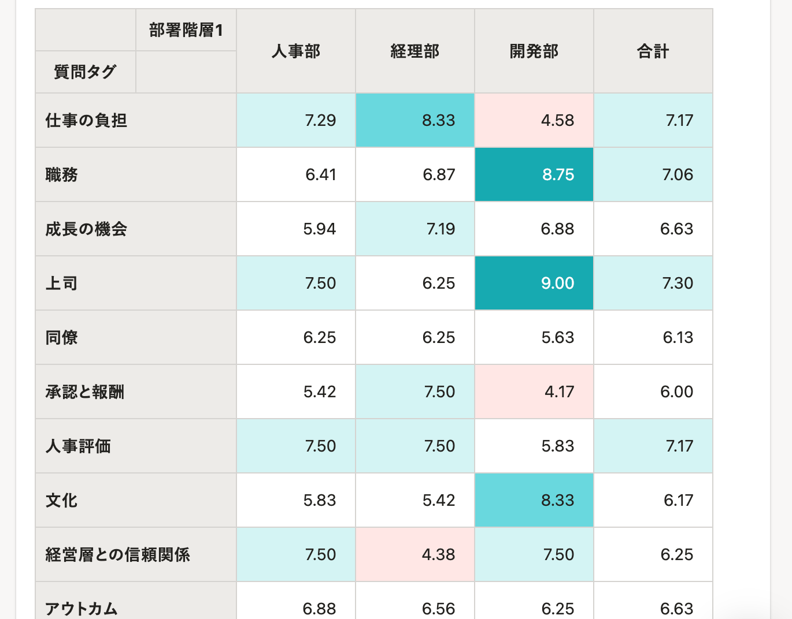
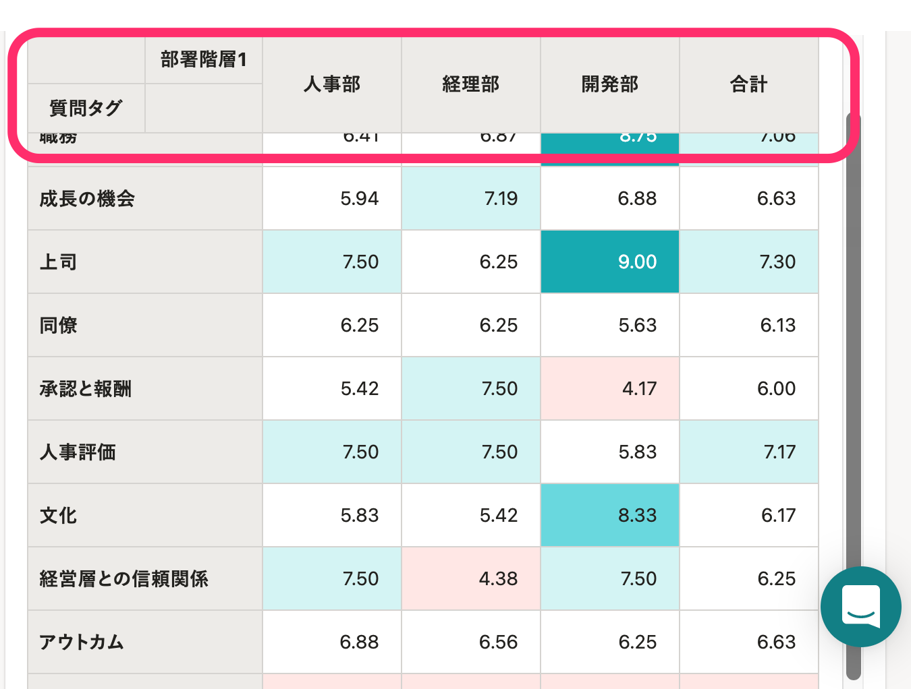

2022年3月10日（木）に行なったアップデートの詳細をお知らせします。

従業員サーベイ機能の変更点は、改善1件でした。

# 📈 改善

## レポート画面で列の見出しを固定したままスクロール可能にしました

これまでは、レポート（分析β）の表の見出しを固定できませんでした。

このため、表が縦に長い場合、下にスクロールすると見出しが確認できなくなる状態でした。

今回のリリースで、列の見出し（下記画像の囲み部分）を固定して表示するようにしました。

これにより、下までスクロールしても、見出しと回答結果を同時に確認できます。

|   変更前   | 変更後 |
| --- | --- |
|  |  |
