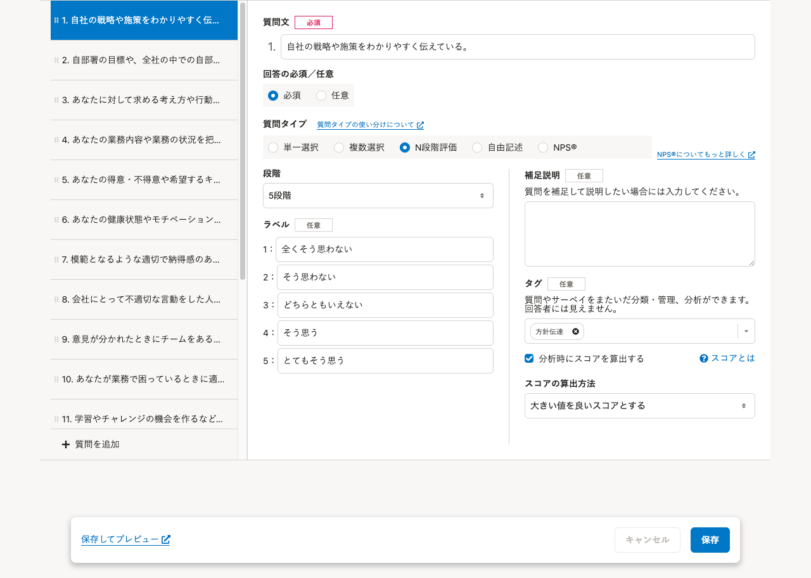
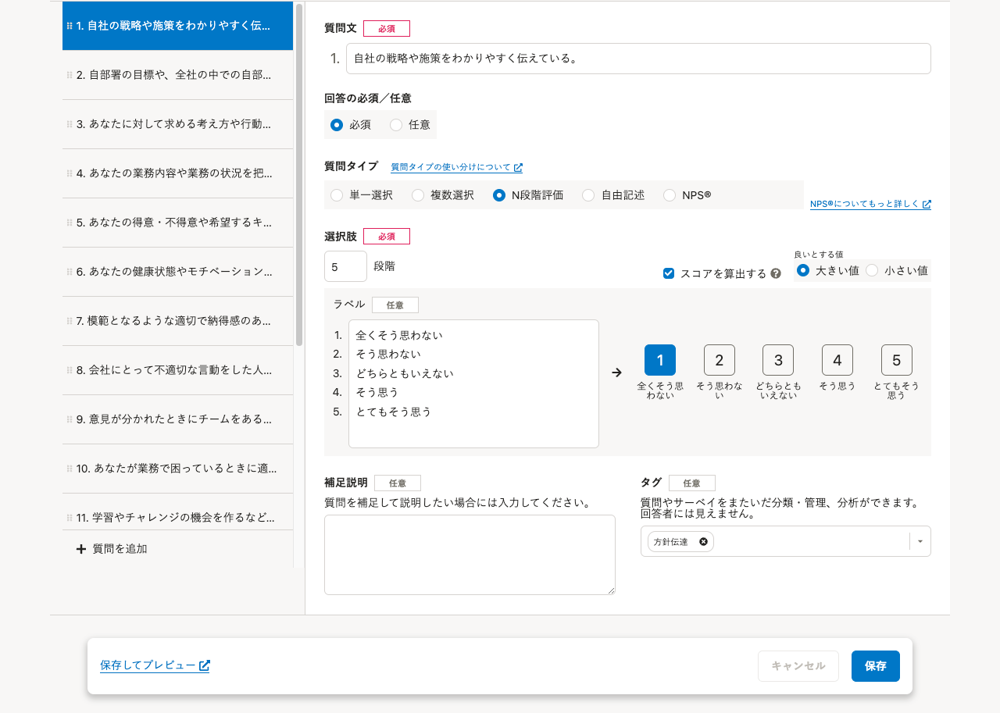

2022年3月17日（木）に行なったアップデートの詳細をお知らせします。

従業員サーベイ機能の変更点は、改善1件でした。

# 📈 改善

## 質問の編集画面で、選択肢の一括入力と回答画面の確認ができるようにしました

### 選択肢の一括入力

これまでは、選択肢ごとに入力欄が分かれており、複数の選択肢をまとめて入力できませんでした。

今回のリリースで、選択肢の入力欄を一つにまとめました。

選択肢を入力したあとに改行して、続けて次の選択肢を入力できます。

また、複数の選択肢をコピーアンドペーストして、一括で追加できます。

### 回答画面の確認

これまでは、選択肢が回答画面でどのように表示されるのか、質問の編集画面で確認できませんでした。

今回のリリースで、選択肢の入力欄の右側にプレビューを表示しました。

回答画面の表示を確認しながら選択肢を編集できます。

|   変更前   | 変更後 |
| --- | --- |
|  |  |
