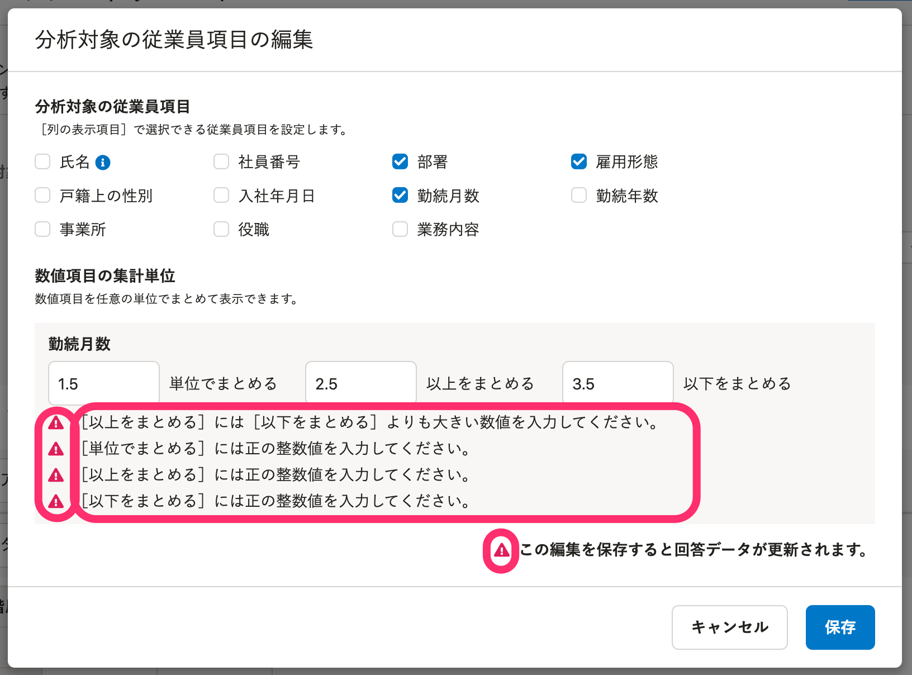
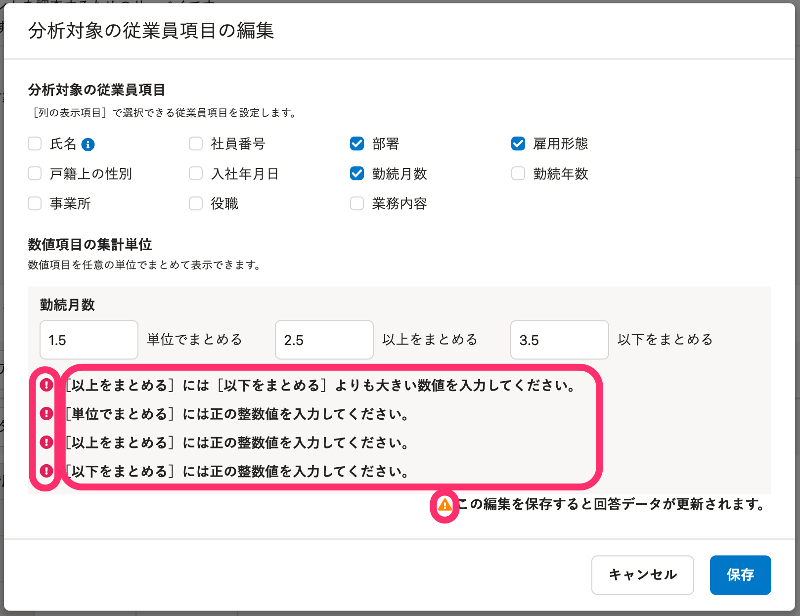

2022年3月28日（月）に行なったアップデートの詳細をお知らせします。

従業員サーベイ機能の変更点は、改善1件でした。

# 📈 改善

## レポート作成時のエラーのアイコンとスタイルを変更しました

レポートの作成中にエラーが発生した際、問題の内容を太字で表示するよう変更しました。

また、エラーを示すアイコンを変更して、他の画面と統一しました。

|   変更前   | 変更後 |
| --- | --- |
|  |  |
