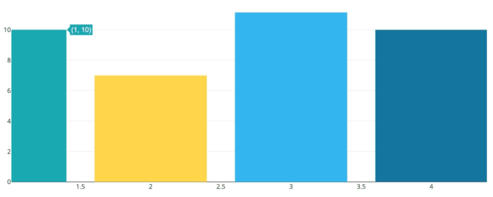

2022年3月30日（水）に行なったアップデートの詳細をお知らせします。

従業員サーベイ機能の変更点は、廃止した機能1件でした。

# 👋 廃止した機能

## 結果画面で棒グラフをドラッグして選択した際、グラフが拡大されないようにしました

結果画面で棒グラフを表示し、ドラッグして特定の範囲を選択すると、グラフが拡大されていました。

この機能は使用頻度が低く、拡大すると元に戻せないため廃止しました。

**変更前の画面**

|   1\. グラフ内でドラッグ   | 2\. グラフが拡大される |
| --- | --- |
|  |  |
