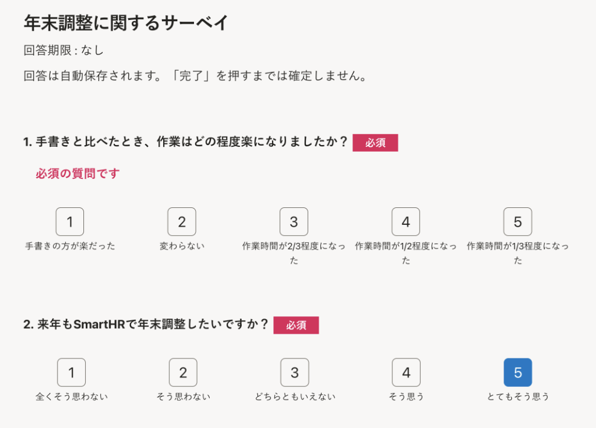
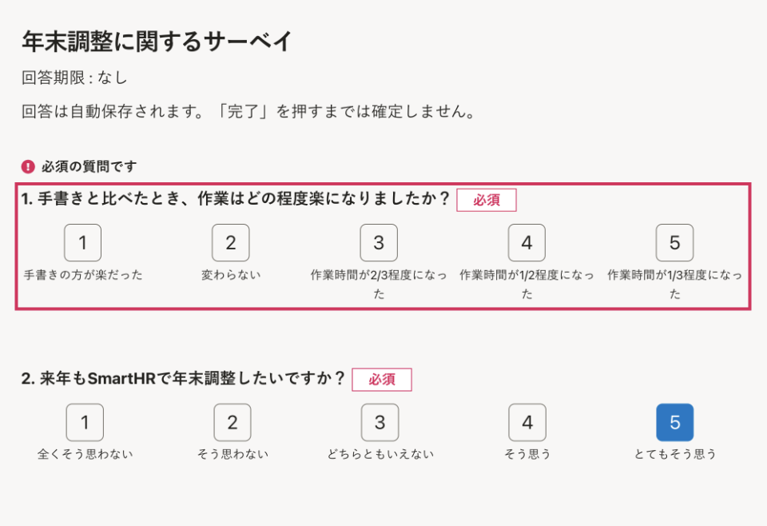

2022年4月1日（金）に行なったアップデートの詳細をお知らせします。

従業員サーベイ機能の変更点は、改善1件、不具合修正1件でした。

# 📈 改善

## 必須の質問に回答していない場合のエラーをわかりやすくしました

回答者が必須の質問に回答していない場合、回答画面にエラーメッセージが表示されます。

これまでは、質問文の下に「必須の質問です」と表示するのみで、回答漏れに気付きにくい状態でした。

今回のリリースで、該当の質問を枠線で囲むようにしました。

これにより、画面をスクロールしながらでもエラーに気付きやすくなりました。

| 変更前 | 変更後 |
| --- | --- |
|  |  |

# 👨‍⚕️ 不具合修正

CSVの書き出し画面に関する1件の不具合修正を行ないました。
