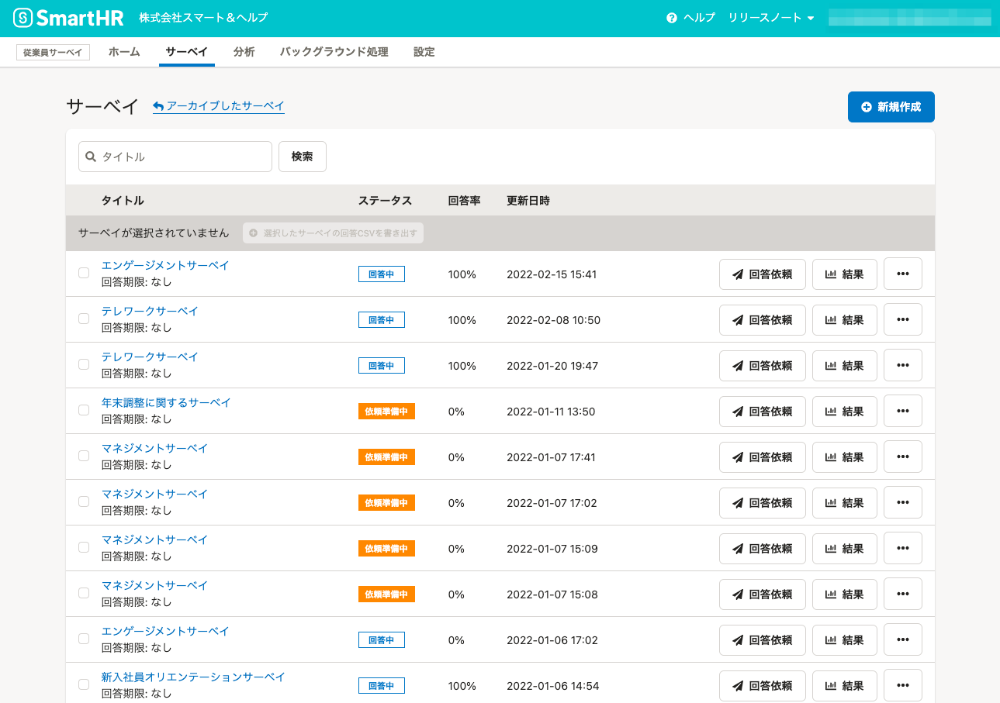

2022年4月7日（木）に行なったアップデートの詳細をお知らせします。

従業員サーベイ機能の変更点は、改善1件でした。

# 📈 改善

## サーベイ一覧のデザインを変更しました

サーベイ一覧のデザインをSmartHR全体のデザインに合わせて変更しました。

### 旧デザインからの変更点

- サーベイ作成ボタンの文言を［新規作成］から［サーベイを作成］に変更しました。
- サーベイのステータス（回答中、依頼準備中など）を一番左に移動しました。
- ［回答依頼］ボタンを廃止し、［操作］ボタンのプルダウンメニューに統合しました。
- ［結果］ボタンを廃止し、回答率をクリックして結果を確認できるようにしました。

|   変更前   | 変更後 |
| --- | --- |
|  |  |
