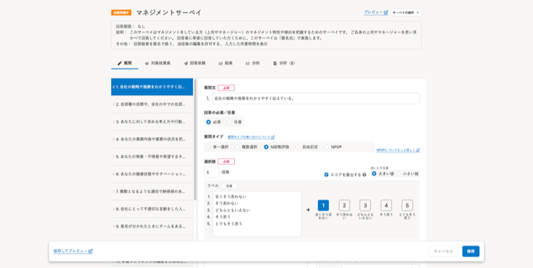
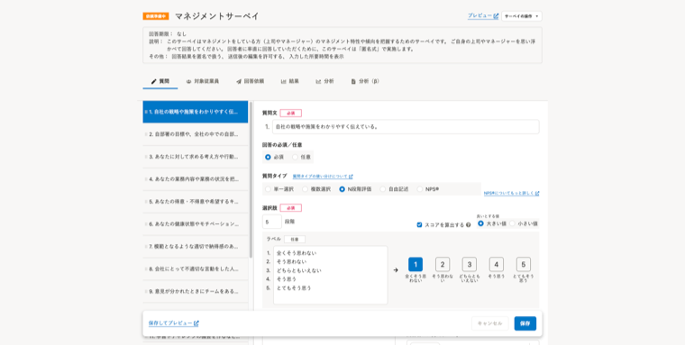

2022年4月8日（金）に行なったアップデートの詳細をお知らせします。

従業員サーベイ機能の変更点は、改善1件、不具合修正1件でした。

# 📈 改善

## 質問編集画面の保存エリアのレイアウトを変更しました

これまでは、ブラウザのウィンドウ幅を広げると、質問編集フォーム下部の保存エリアの横幅も広がっていました。

今回のリリースで、保存エリアの幅を質問編集フォームの幅と統一し、操作しやすくしました。

| 変更前 | 変更後 |
| --- | --- |
|  |  |

# 👨‍⚕️ 不具合修正

共同管理者の設定画面に関する1件の不具合修正を行ないました。
