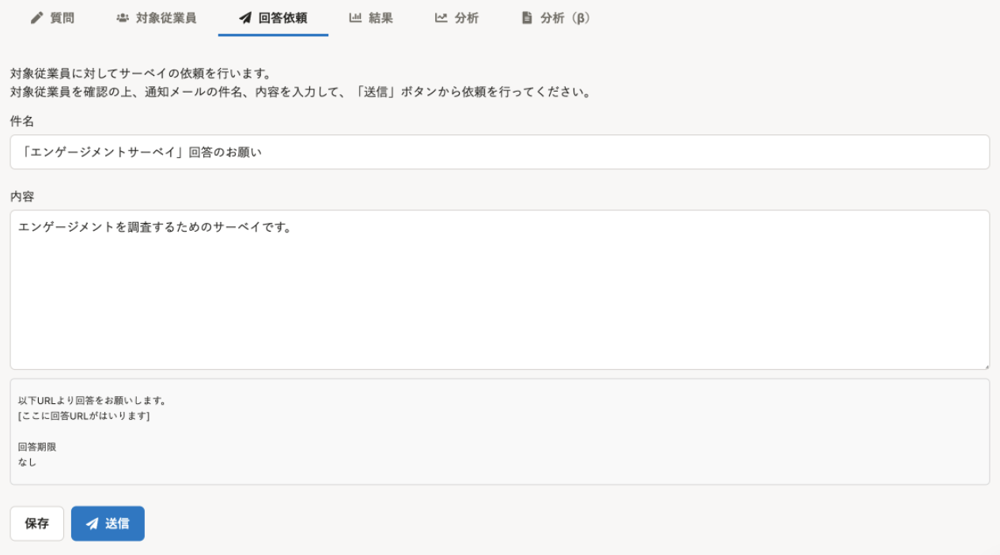
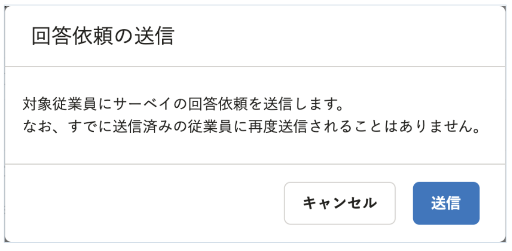
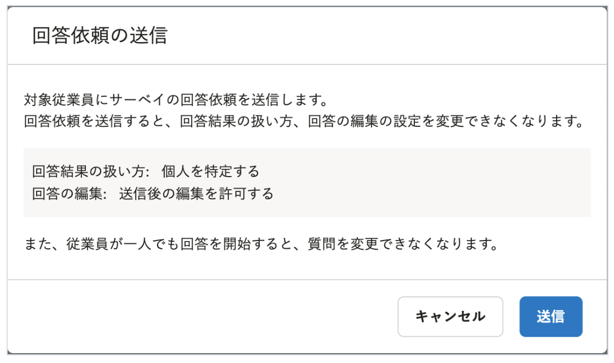

2022年4月22日（金）に行なったアップデートの詳細をお知らせします。

従業員サーベイ機能の変更点は、改善2件でした。

# 📈改善

## 回答依頼の再送時、誰に通知されるのかを明確にしました
回答依頼を再送する場合、すでに送信済みの従業員には通知されません。
これまでは、回答依頼の［送信］ボタンをクリックしないと、誰に通知されるのか確認できませんでした。

今回のリリースにより、すでに送信済みの従業員には再送されない旨を［送信］ボタンの上部に明記しました。
あわせて、［送信］ボタンと［保存］ボタンの位置や、送信前に表示される確認画面の内容を変更しました。

| 変更前 | 変更後 | 
| -------- | -------- | 
| || 
|  || 

## サーベイの検索結果が0件の場合の表示を変更しました
これまでは、サーベイ一覧画面でサーベイを検索し、検索結果が0件だった場合に「まだサーベイはありません。新しいサーベイを作成しましょう。」と表示されていました。

今回のリリースにより、「条件に一致するサーベイはありません。」と表示されるよう変更しました。