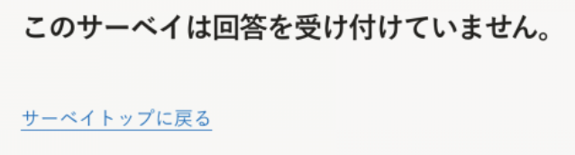
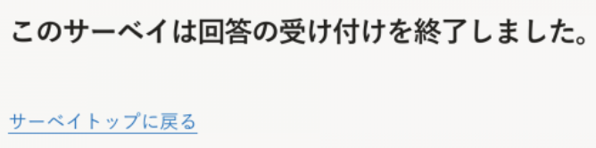

2022年4月26日（火）に行なったアップデートの詳細をお知らせします。

従業員サーベイ機能の変更点は、改善1件でした。

# 📈改善

## 回答の締め切り後、回答画面に表示される文言を変更しました
これまでは、回答の締め切り後に回答画面にアクセスすると、「このサーベイは回答を受け付けていません」と表示されていました。

「受け付けていません」という言葉が否定的な印象を与えるため、「このサーベイは回答の受け付けを終了しました」という文言に変更しました。

| 変更前 | 変更後 | 
| -------- | -------- | 
| || 