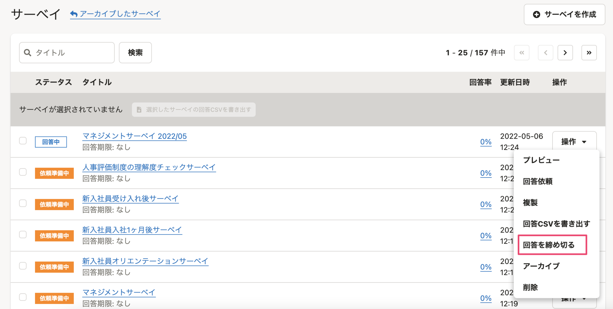
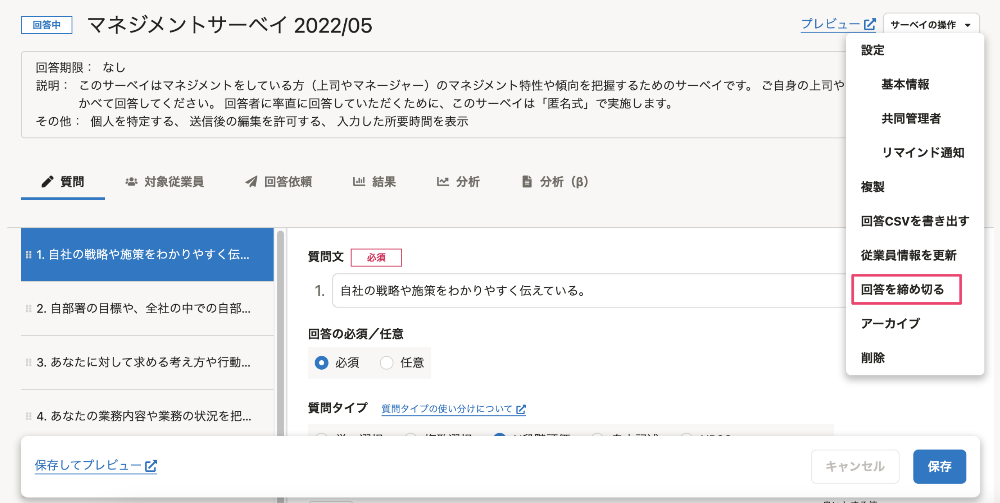
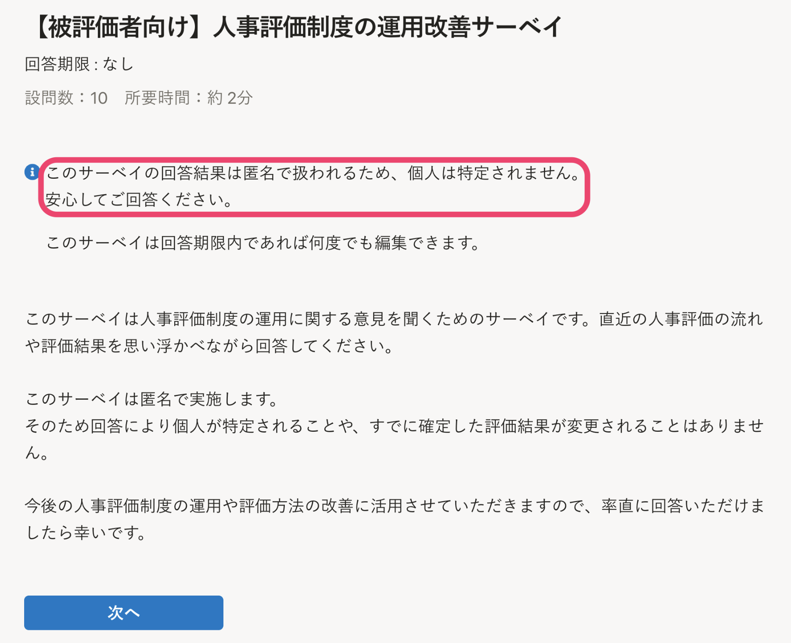
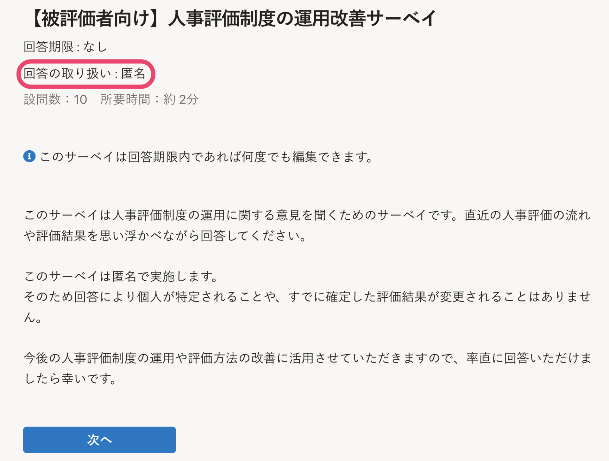
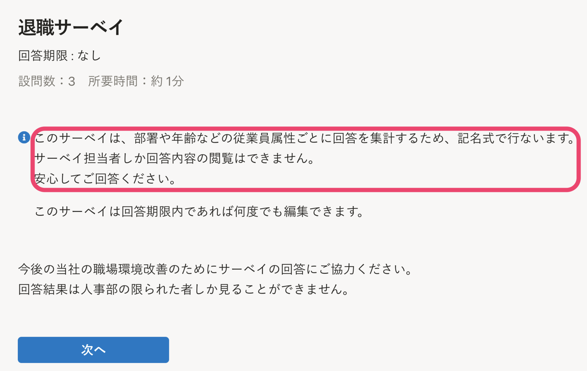
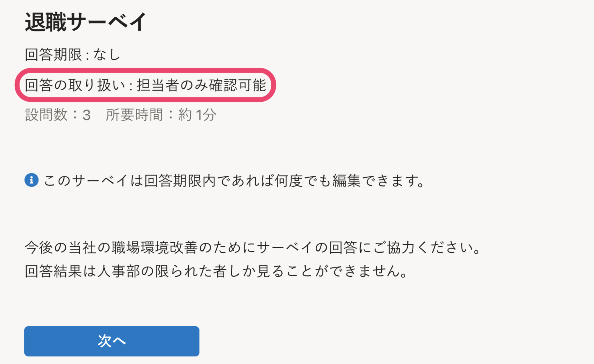

2022年5月12日（木）に行なったアップデートの詳細をお知らせします。

従業員サーベイ機能の変更点は、新機能1件、改善1件でした。

# ✨ 新機能

## 回答の締め切り機能を追加しました

ただちに回答を締め切りたい場合、これまでは回答期限を過去の日付に変更する必要がありました。

今回のリリースで［回答を締め切る］という機能を追加し、より直感的に操作できるようにしました。サーベイの一覧、および個別のサーベイの編集画面から、回答を締め切ることができます。

| サーベイ一覧 | サーベイ編集画面 | 
| -------- | -------- | 
| || 

# 📈改善

## 従業員向け回答画面の「匿名」「記名」に関する表示を変更しました

これまでは、回答の取り扱い方法（匿名または記名）に応じて、従業員向け回答画面に説明文が自動で表示されていました。

今回、この説明文を削除しました。
代わりに、サーベイのタイトル下部に「回答の取り扱い」というセクションを追加しました。設定に応じて「回答の取り扱い：匿名」または「回答の取り扱い：担当者のみ確認可能」と表示されます。

自動で挿入される説明を最小限とすることで、状況に応じて自由に説明文を入力しやすくなりました。

| 変更前 | 変更後 | 
| -------- | -------- | 
||| 
||| 