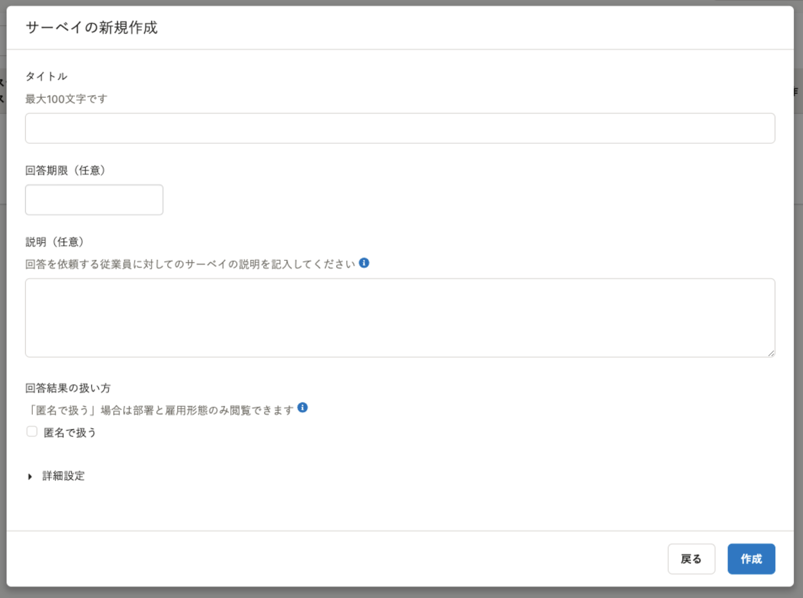
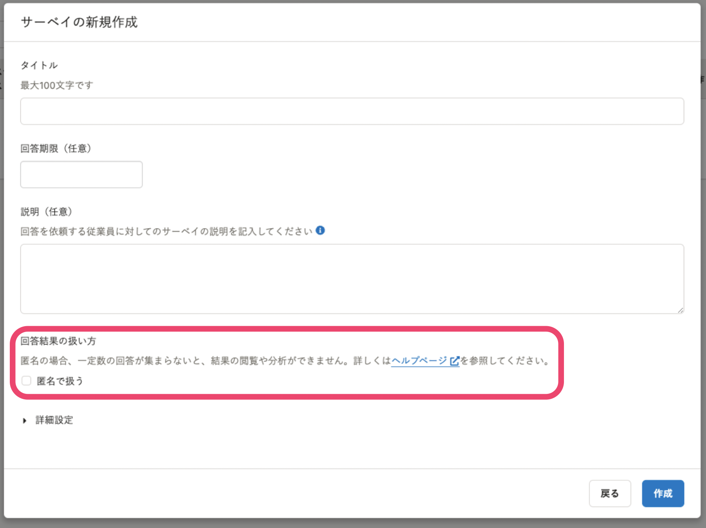
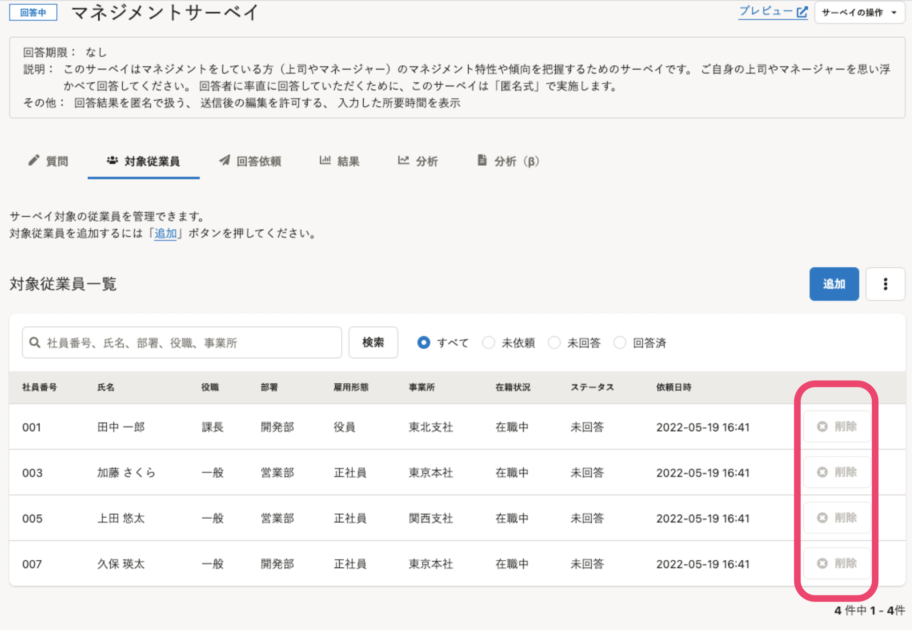
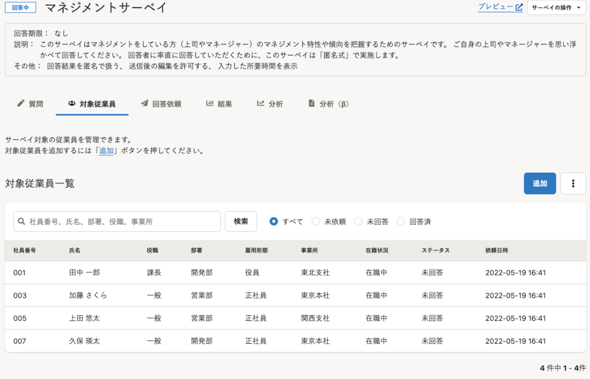

2022年5月19日（木）に行なったアップデートの詳細をお知らせします。

従業員サーベイ機能の変更点は、改善2件でした。

# 📈改善
## サーベイ作成画面の「匿名」に関する説明を変更しました
サーベイの回答を匿名で扱う場合、一定数の回答が集まらないと、結果の閲覧や分析が制限されます。
これまでは、制限について、サーベイ作成画面で十分に説明できていませんでした。

今回のリリースで、サーベイ作成画面の説明文を変更し、ヘルプページ[「Q.「匿名で扱う」サーベイとは？」](https://knowledge.smarthr.jp/hc/ja/articles/900005669166)へのリンクを追加しました。
これにより、サーベイ作成時に、匿名で扱う場合は制限があることを認識しやすくしました。
| 変更前 | 変更後 | 
| -------- | -------- | 
| | | 

## 対象従業員の一覧画面で、回答依頼を送信済みの従業員の「削除」ボタンを非表示にしました

これまでは、対象従業員の一覧画面で、回答依頼を送信した従業員の右側に「削除」ボタンを表示していました。

しかし仕様上、このボタンは押せない状態だったため、表示しないよう変更しました。

| 変更前 | 変更後 | 
| -------- | -------- | 
| | | 