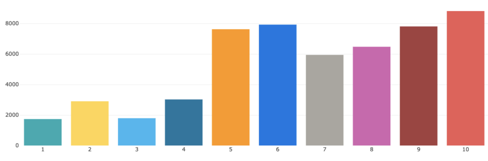
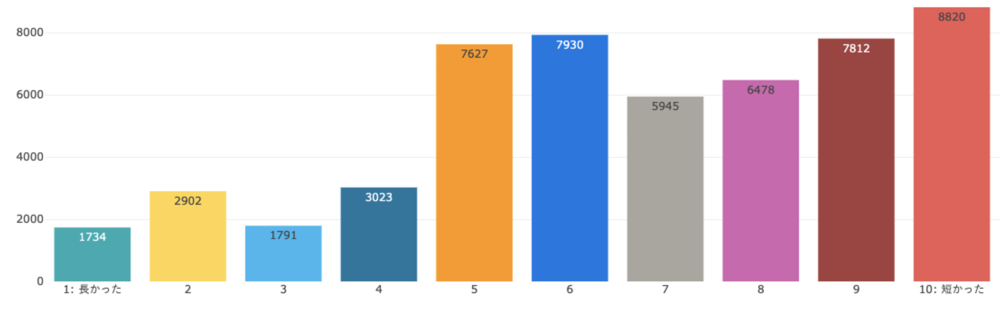

2022年6月7日（火）に行なったアップデートの詳細をお知らせします。

従業員サーベイ機能の変更点は、改善1件、不具合修正1件でした。

# 📈改善
## 結果画面のグラフのレイアウトを変更しました

結果画面のグラフのレイアウトを以下の通り変更しました。
* 棒グラフを表示した場合、グラフごとに回答件数を表示
* N段階の質問の場合、グラフ内の軸ラベル等に選択肢の文言（例：良い/悪い）を表示

これまでは棒グラフを表示した場合、選択肢ごとの回答件数が分かりにくい状態でした。
また、N段階の質問の場合、グラフ内の軸ラベル等には、選択肢の段階（例:1/2/3）のみが表示されていました。

今回の変更により、直感的に回答結果を把握しやすくしました。

| 変更前 | 変更後 | 
| -------- | -------- | 
||| 

# 👨‍⚕️ 不具合修正

回答CSVの書き出しに関する1件の不具合修正を行ないました。

