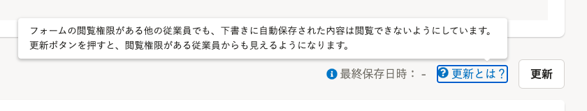
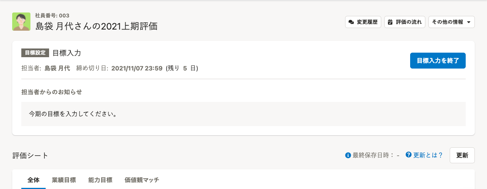

2021年11月1日（月）に行なったアップデートの詳細をお知らせします。

人事評価機能の変更点は、カイゼン2件でした。

# 🚸💬カイゼン

## 評価シートの上に表示されるタスクパネルのボタンや配置を変更

タスクの担当者が**評価シートの入力途中の内容を保存する操作**と、**タスクを完了する操作** を混同してしまうことがあったことから、

- 評価シートの更新
- タスクを完了

のボタンの文言に変更しました。2つのボタンの役割の違いを理解する補助的な情報として、［更新とは？］という文字列に照準を合わせるとボタンの意味を伝えるメッセージを追加しました。

合わせて、タスクパネル全体のボタンや情報の表示場所を整理し直しました。

## デザインシステムのルールに則った余白などに変更

画面上部、評価テンプレート設定ダイアログ、スケジュール設定ダイアログ、フォームの追加ダイアログ、フォームの設定ダイアログの余白などをデザインシステムに則って変更しました。
