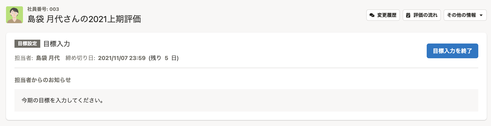
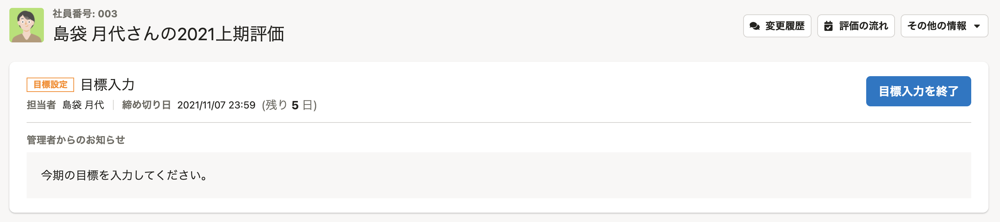

2021年11月4日（木）に行なったアップデートの詳細をお知らせします。

人事評価機能の変更点は、カイゼン1件でした。

# 🚸カイゼン

## 評価シートの上に表示されるタスクパネルの意匠を調整しました

- フェーズの名前のラベルの色を、意匠的に目立たせました。
- ［担当者］と［締切］の調整。
    - 担当者と締切、担当者名と日時情報をそれぞれ情報構造上に揃えています。
    - 情報を読み取りやすくするために担当者と締切の間にborderを入れてます。

| Before | After |
| --- | --- |
|  |  |
