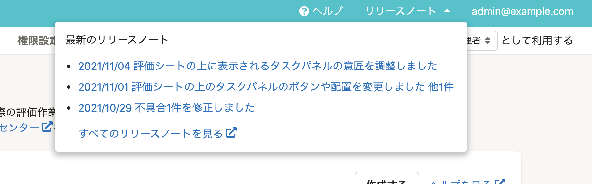

2021年11月9日（火）に行なったアップデートの詳細をお知らせします。

人事評価機能の変更点は、カイゼン2件でした。

# 🚸💬カイゼン

## ヘッダーにリリースノートへのリンクを追加しました

ヘッダーに、人事評価のリリースノート一覧と最新記事3件へのリンクを追加しました。

［リリースノート  ］を押すと、最新記事3件のタイトルを表示します。

記事タイトルからはそれぞれの記事に、［すべてのリリースノートを見る  ］からは人事評価のリリースノート一覧に遷移できます。

## タスクの完了を通知するメールにコメント追加しました

タスクを完了した時に送信される通知メールに、タスク完了時に入力されたコメントも含めるようになりました。
