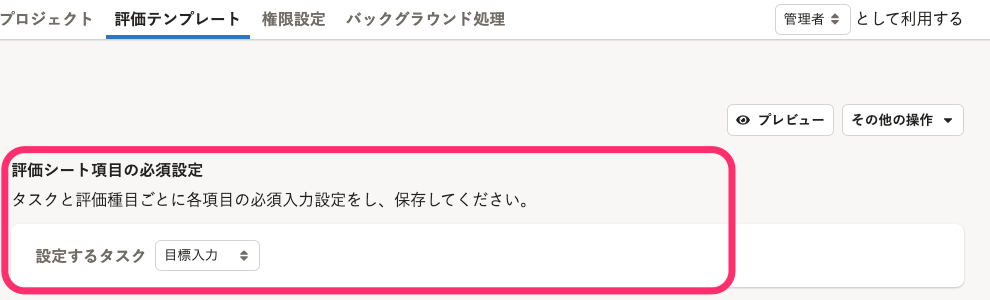
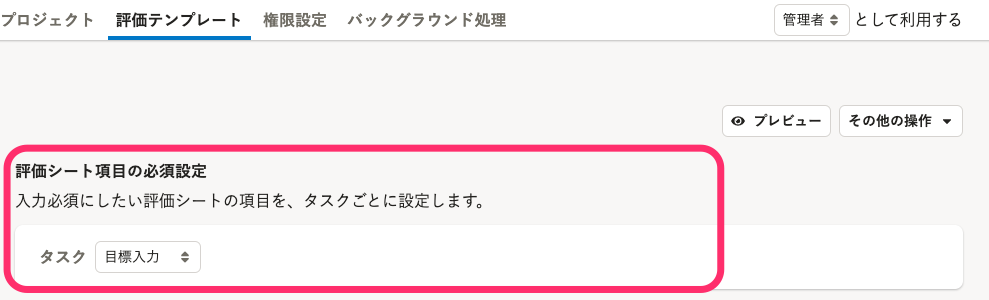
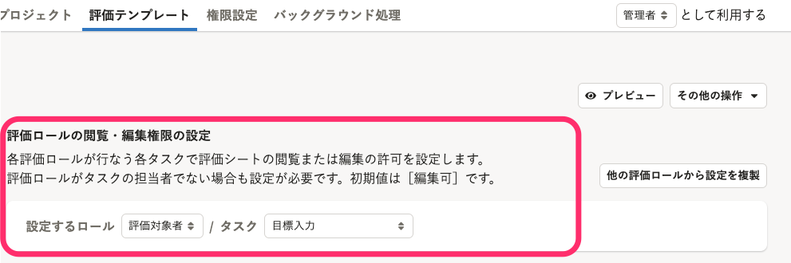
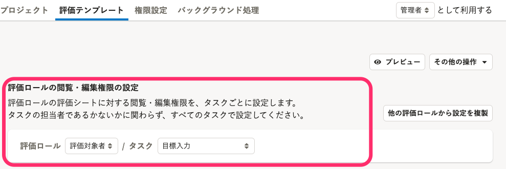
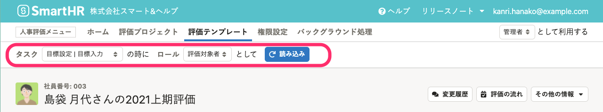
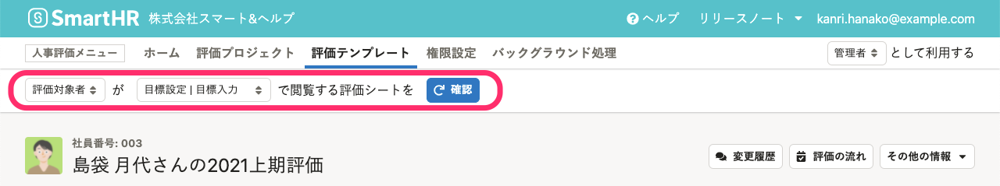

2021年11月10日（水）〜17日（水）に行なったアップデートの詳細をお知らせします。

人事評価機能の変更点は、改善4件、不具合修正2件でした。

# 🚸💬改善

## 評価シートの記入を終えタスクを完了するときに、［更新］ボタンを押して下書きの保存をしていなくても、［{タスク名}を終了］ボタンを押せるようになりました

［評価シート］画面でタスクを終了する際に、これまでは評価シートを編集していた場合は、 **［更新］** ボタンを押して下書きを保存してから、タスクの終了ボタンを押す必要がありましたが、 **［{タスク名}を終了］** ボタンを押すと、下書きが存在していた場合には下書きの保存も一緒に行なうように処理を変更しました。

いままでどおり、 **［更新］** ボタンを押してから**タスクの終了**ボタンを押すこともできます。

## タスク完了の通知メールに、次のタスクのスケジュールを記載するようにしました

タスクが完了したときに次の担当者に送られるメールの本文に、次のタスクのスケジュールも記載するようにしました。

メールの本文に記載されるスケジュールは、評価プロジェクトの **［スケジュール設定］** 画面で設定できます。

:::related
[評価プロジェクトに評価テンプレートを取り込む](https://knowledge.smarthr.jp/hc/ja/articles/4408433101593)
:::

## ［評価ロールごとの閲覧・編集権限設定］、［評価シート項目の必須設定］の文言を修正しました

評価テンプレートの **［その他の設定］** の一つ、 **［評価ロールの閲覧・編集権限設定］** の説明やラベルをより適切な文言に変更しました。

| Before | After |
| --- | --- |
|  |  |
|  |  |

## 評価シートプレビューの切り替えのUIを修正しました

 **［タスク］** 、 **［評価ロール］** という並びになっていた順序を、［**評価ロールの閲覧・編集権限の設定** **］** と揃えて **［評価ロール］** 、 **［タスク］** にしました。

また、今回の変更で、項目 **［評価ロール］** 、 **［タスク］** のラベルを非表示にしましたが、アクセシビリティの観点から、ブラウザの読み上げ機能使用時には項目名を読み上げるスタイルを適用しています。

| Before | After |
| --- | --- |
|  |  |

# 🐛不具合修正

## 評価プロジェクトの絞り込み検索の不具合を修正しました

 **［評価プロジェクト詳細］** 画面の **［絞り込み条件］** で、 **［進行中のタスク］** の **［**  **期限が過ぎたタスク］** を選択した場合に、今日が終了日のタスクも絞り込み結果に表示されていましたが、表示されないように修正しました。

## セレクトボックスやボタンの文字の位置がズレたり、見切れる問題を修正しました

いくつかの画面で発生していたため、修正しました。
