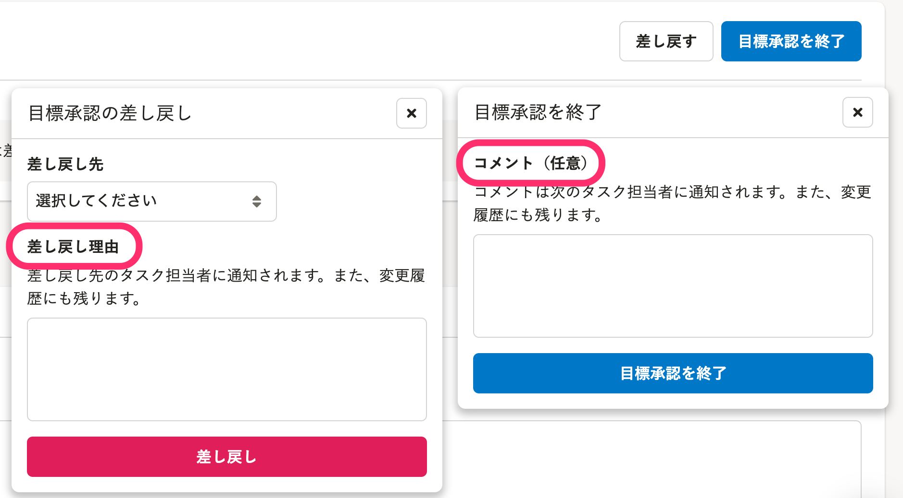
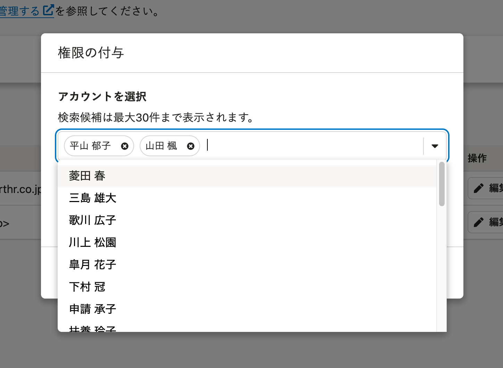
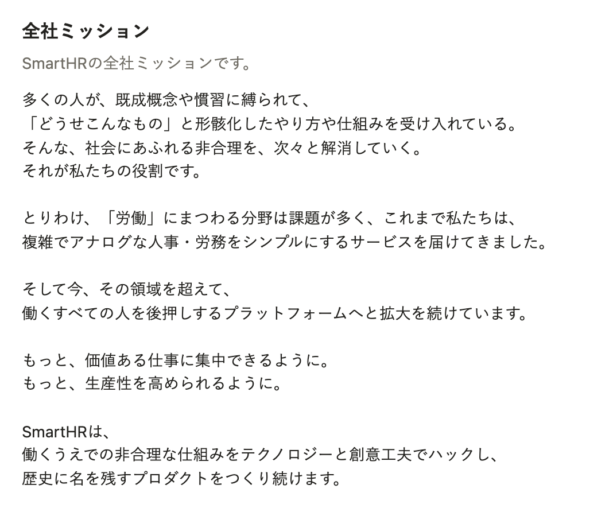
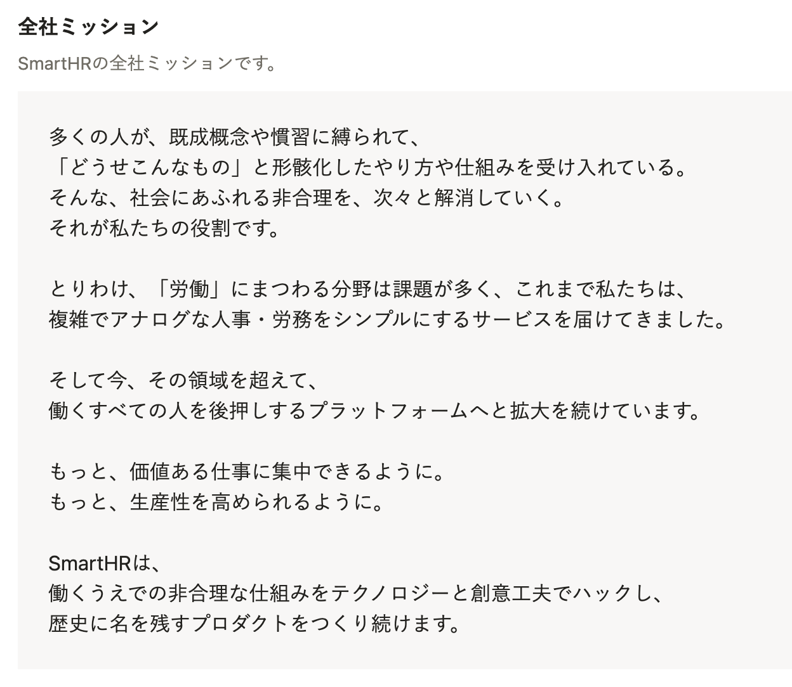

2021年11月18日（木）〜24日（水）に行なったアップデートの詳細をお知らせします。

人事評価機能の変更点は、改善5件でした。

# 🚸💬改善

## タスクを完了するときに表示されるダイアログ内のラベルを変更しました

- タスク完了時の **［コメント］** に、「特筆すべきことがない場合、何を入力したらいいのか戸惑う」ため `（任意）` を追加しました。
- 差し戻しの場合のラベルは、 **［コメント］** から **［差し戻し理由］** に変更しました。

## バックグラウンド処理の通知先を実行者のみに変更しました

これまでは **［評価対象者の追加］** などのバックグラウンド処理が実行されたとき、処理が完了すると、機能管理者または業務担当者の権限が付与されている、すべての人事評価機能の管理者に通知をしていました。

管理者が受け取る通知が大量になってしまうケースがあるため、**バックグラウンド処理の実行者にのみ通知する**ように変更しました。

## ［必須入力］を［入力必須］に変更しました

各画面に表示されている **［必須入力］** の文言を、SmartHRのライティングガイドラインに則り **［入力必須］** に統一しました。

[用字用語｜SmartHR Design System](https://smarthr.design/products/contents/idiomatic-usage/usage/#recUVMSOhVDbQjMMN-0)

## ［権限設定］の［権限の付与］画面の検索ボックスが変わりました

 **［権限設定］** の **［権限の付与］** 画面に表示されるアカウント検索のUIを、 **［評価プロジェクト詳細］** の **［評価テンプレート取り込み］** 画面と同様のUIに変更しました。

UIのみの変更であり、検索結果や付与する権限については変更ありません。

:::related
[人事評価の管理者権限をアカウントに付与する](https://knowledge.smarthr.jp/hc/ja/articles/4406940321049#toc--4)
:::

## 表示フォーム［固定テキスト］のUIを目立つように改善しました

表示フォーム **［固定テキスト］** の **［埋め込みテキスト］** の部分について、評価シート上でより目立つようにUIを改善しました。

| Before | After |
| --- | --- |
|  |  |
