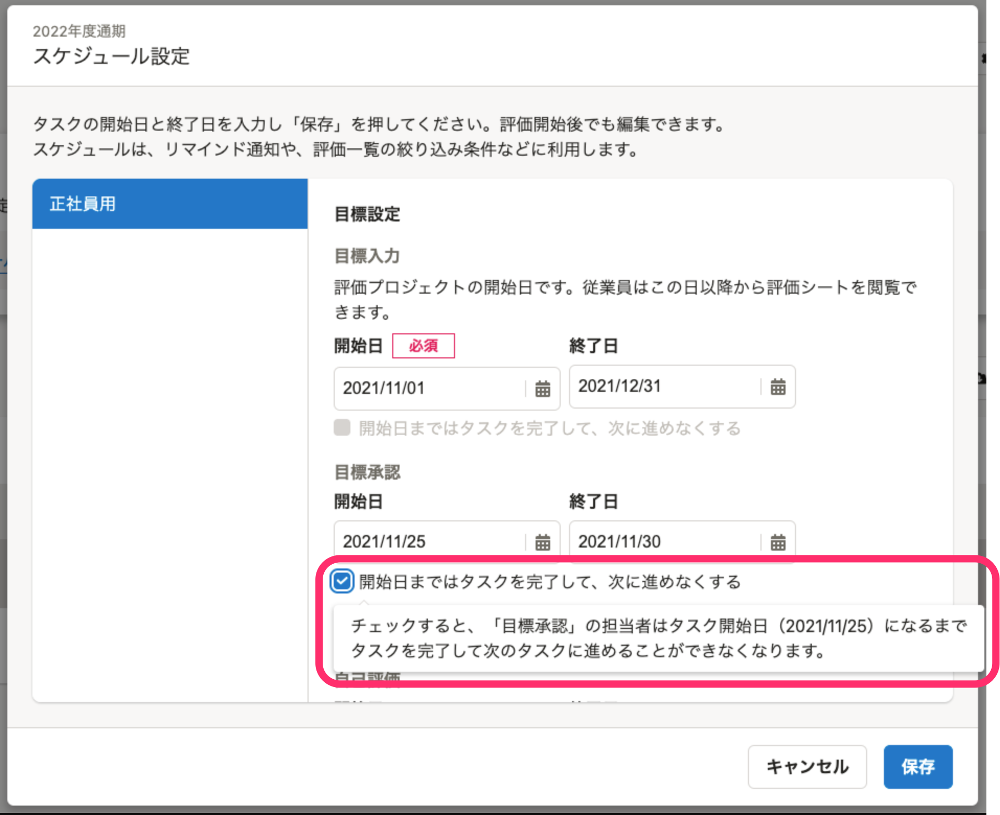
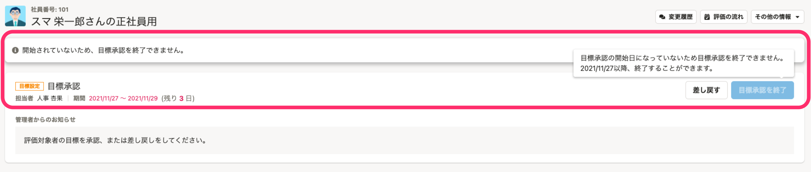
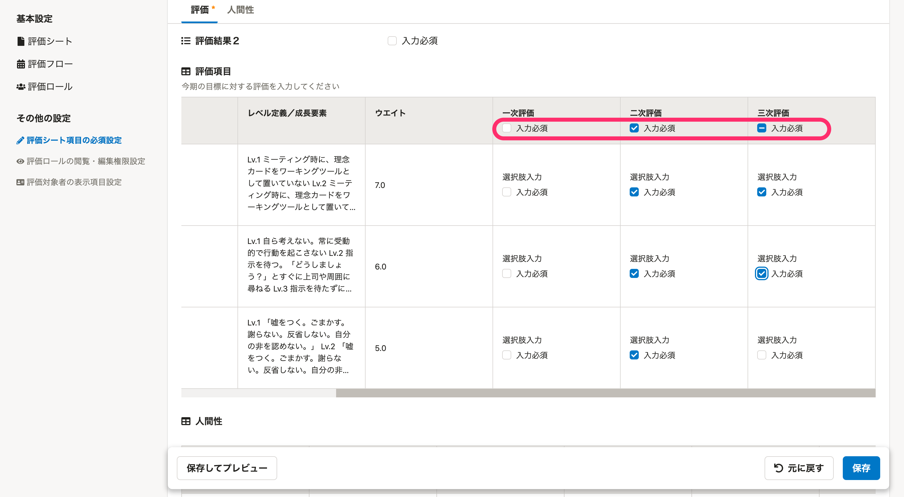
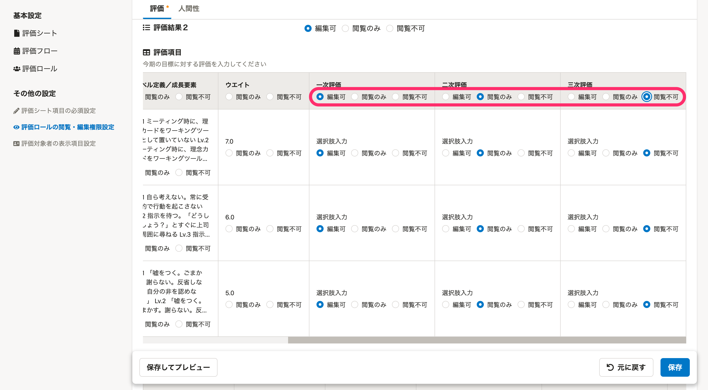
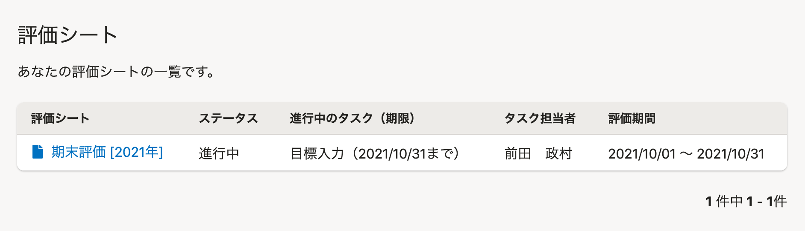

2021年11月25日（木）〜12月1日（水）に行なったアップデートの詳細をお知らせします。

人事評価機能の変更点は、新機能2件、改善3件、不具合修正2件でした。

# ✨新機能

## タスクの開始日前にタスクの完了を制限する設定ができるようにしました

これまで、スケジュールで設定したタスクの開始前でも前のタスクが完了した時点で次のタスクの担当者はタスクを完了することができました。

管理者が意図しないスケジュールで評価を進められないようにするため、タスクのスケジュール開始日前にタスクの完了ができないようにする設定を追加しました。

この設定を有効にすると、スケジュール開始日前は評価シートのタスク完了のボタンが押せないようになります。

## 評価プロジェクト詳細の［評価シート項目の必須設定］と［評価ロールの閲覧・編集権限］にて、表組みフォームで列の設定を一括で変更できるようにしました

評価テンプレート詳細画面のその他の設定で、表組みフォームに対して一括設定できるUIを追加しました。

# 🚸💬改善

## 退職済のアカウントは評価にアクセスできないようにしました

従業員情報で在籍状況が **［退職済］** のアカウントまたは、ユーザーアカウントの権限が **［退職者］** のアカウントで評価にアクセスするとSmartHRトップを表示するようにしました。

## ［紐付け］を［紐づけ］に変更しました

各画面に表示されている **［紐付け］** の文言を、SmartHRのライティングガイドラインに則り **［紐づけ］** に統一しました。

[用字用語｜SmartHR Design System](https://smarthr.design/products/contents/idiomatic-usage/usage/#rec5PdPTnbdwUVyDO-0)

## 評価シート一覧ページの表示項目を修正しました

従業員モードで表示する、評価シート一覧の列のラベル名を **［進行中タスク］** から **［進行中タスク（期限）］** に変更しました。また、 **［タスク担当者］** の列を追加しました。

# 🐛不具合修正

## 評価プロジェクトの進行中タスクの不具合を修正しました

進行中タスクを終了から終了に変更した時に変更履歴が残っていたので、修正しました。

## プロジェクト終了日に SmartHR に従業員を追加した時の不具合を修正しました

プロジェクト終了日に SmartHR に従業員を追加した時、当該従業員が評価対象者として追加できない不具合を修正しました。
