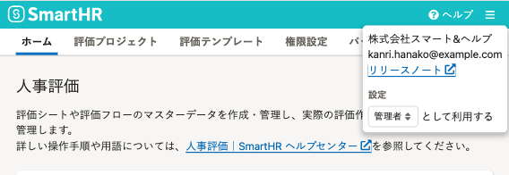
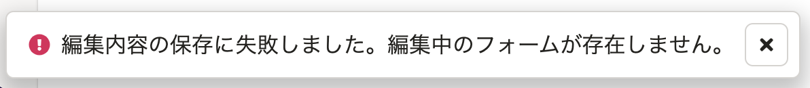
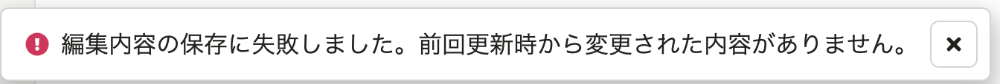
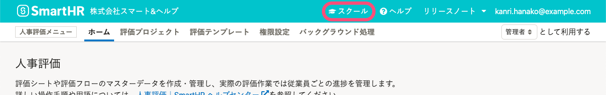

2021年12月2日（木）〜8日（水）に行なったアップデートの詳細をお知らせします。

人事評価機能の変更点は、改善4件、アクセシビリティ1件、不具合修正1件でした。

# 🚸💬改善

## タスクの［完了］ボタンを押した際に、ダイアログを表示するようにしました

評価シートの入力画面で、タスクの担当者が **［完了］** ボタンを押した際に、完了を伝えるダイアログを表示するようにしました。

## モバイルでの閲覧時にも、管理者モードと従業員モードの切り替えUIを追加しました

これまでタブレットやスマートフォンからの閲覧時には、管理者モードと従業員モードを切り替えるプルダウンが表示されず、PCで閲覧したときの設定が保持されたまま切り替えができませんでした。

タブレットから使用する管理者を想定して、モードを切り替えるUIを追加しました。

## 下書きがないときに［更新］ボタン押すと表示されるエラーメッセージを修正しました

評価シートの入力画面で下書きがない時に **［更新］** ボタンを押すと、わかりづらいエラーメッセージが出ていたので、文言を変更しました。

| Before | After |
| --- | --- |
|  |  |

## ヘッダーにスクールへのリンクを追加しました

業務担当者、機能担当者にのみ、ヘッダーにSmartHRスクールへのリンクが表示されるようにしました。

# ♿️アクセシビリティ

## テキスト入力時のスクリーンリーダーでの読み上げを改善しました

これまで、テキストエリアに1文字入力するごとに項目名や入力内容が読み上げられていました。

1文字ごとに読み上げてしまうと、ユーザーの入力操作を妨げるため、修正しました。

# 🐛不具合修正

## 閲覧・編集権限設定で、一括設定をするときに入力必須項目は対象外にしました

評価テンプレートの **［その他の設定］** にある **［評価ロールの閲覧・編集権限設定］** で、入力必須項目を **［閲覧のみ］［閲覧不可］** に一括変更できる状態だったのを、修正しました。
