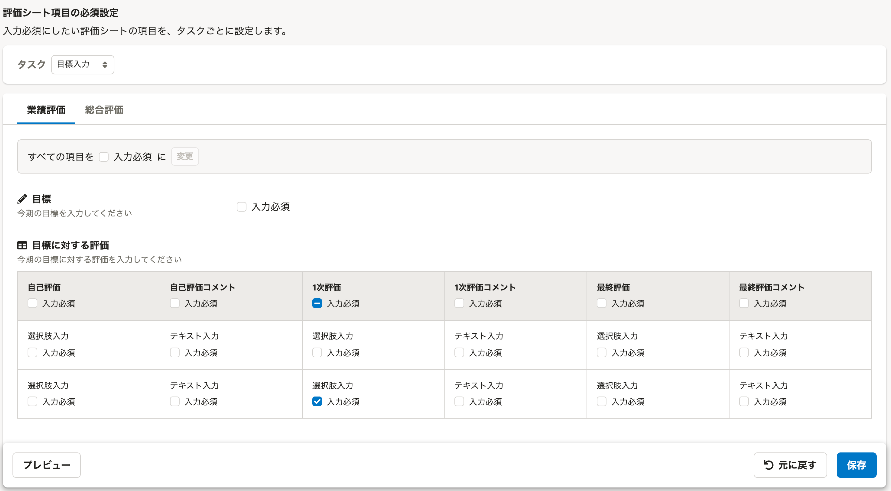
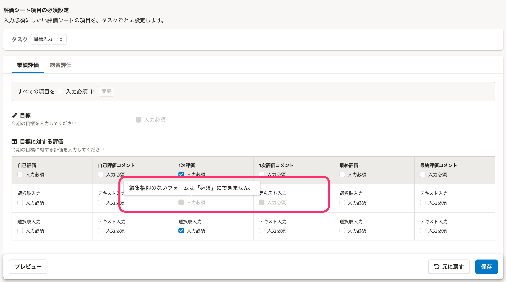
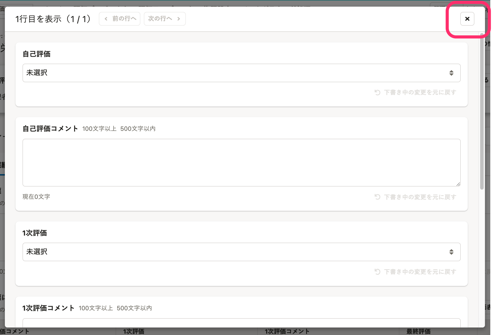

2021年12月9日（木）〜15日（水）に行なったアップデートの詳細をお知らせします。

人事評価機能の変更点は、改善5件、アクセシビリティ1件、不具合修正2件でした。

# 🚸💬改善

## モバイルのUIを改善しました

従業員側画面のモバイル表示がより見やすくなりました。

## タスクの開始日に通知を送るようにしました

進行中のタスクの開始日に、担当者に対してタスクが開始されたことを通知する機能を追加しました。

 **［評価プロジェクト］** の **［スケジュール設定］** で設定でタスクの開始日が設定されている場合に、開始日当日の8:00ころに通知します。

:::related
[評価プロジェクトに取り込んだ評価テンプレートにスケジュールを設定する](https://knowledge.smarthr.jp/hc/ja/articles/4408433101593#toc--4)
:::

## 評価シート項目の必須設定を、フォームの閲覧・編集権限が［編集可］の場合のみ設定できるようにしました

これまでは **［評価ロールの閲覧・編集権限設定］** で設定したフォームの閲覧・編集権限に関わらず、評価シート項目の必須設定ができたため、保存ボタンを押してエラーが表示されるまで設定の矛盾に気づくことができませんでした。

フォームの閲覧・編集権限が **［閲覧のみ］［閲覧不可］** の場合には、あらかじめ必須設定ができないようにしました。

| Before | After |
| --- | --- |
|  |  |

## ダイアログやボタンを適切な名称に変更しました

ダイアログやボタンの操作でできることをより適切に表現するため、以下2箇所の名称を変更しました。

1.  評価プロジェクトの **［評価者の変更］** ダイアログの名称を **［評価者を設定］** に変更しました。
2.  評価シートの表組みの **［まとめて入力］** ボタンの名称を、 **［この行を表示］** に変更しました。あわせて、ボタンクリック時に表示されるダイアログのタイトルを **［1行目を表示（1 / n）］** のように、現在の表示行がわかる名称に変更しました。

## ［評価ロールの閲覧・編集権限設定］画面表示のパフォーマンスを改善しました

 **［評価ロールの閲覧・編集権限設定］** 画面表示がより速くなりました。

# ♿️アクセシビリティ

## ［この行を表示］ダイアログの閉じるボタンを、スクリーンリーダーで読み取れるようにしました

評価シートの表組みの **［この行を表示］** ボタンをクリックしたときに表示されるダイアログの、右上にある閉じるボタンをスクリーンリーダーで読み取れるようにしました。

# 🐛不具合修正

## ［評価テンプレート設定］ダイアログをスクロールできるようにしました

評価プロジェクトの **［評価テンプレート設定］** 画面で、取り込む評価テンプレートの数が多いとレイアウトが崩れる場合があったので、ダイアログ内でスクロールできるようにしました。

## テーブルやボタンの表示崩れを修正しました

テーブルやボタンの文字がずれているなど、画面の表示が崩れていた箇所を修正しました。
