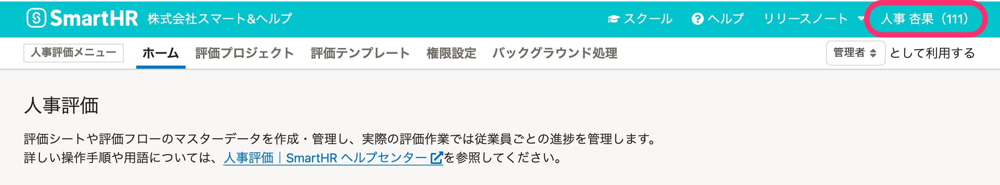

2021年12月16日（木）〜22日（水）に行なったアップデートの詳細をお知らせします。

人事評価機能の変更点は、改善1件でした。

# 🚸💬改善

## 従業員名をヘッダーに表示するようにしました

これまでログインしているアカウントのメールアドレスが表示されていましたが、従業員の氏名と社員番号を表示するようにしました。

ビジネスネームが登録されている場合はビジネスネームを優先して表示します。

