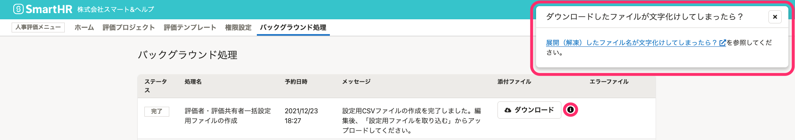

2021年12月23日（木）〜2022年01月05日（水）に行なったアップデートの詳細をお知らせします。

人事評価機能の変更点は、改善1件でした。

# 🚸💬改善

## バックグラウンド処理一覧に、ダウンロードしたファイルの名前が文字化けしてしまった際の対応方法を載せたヘルプページへのリンクを表示しました

動作環境以外の解凍ソフトを使用した場合、バックグラウンド処理一覧からダウンロードしたファイルのファイル名が文字化けしてしまうことがあります。

操作手順でも紹介している、文字化けした場合の対応方法を載せたヘルプページへのリンクをダウンロードボタンの近くに追加しました。

