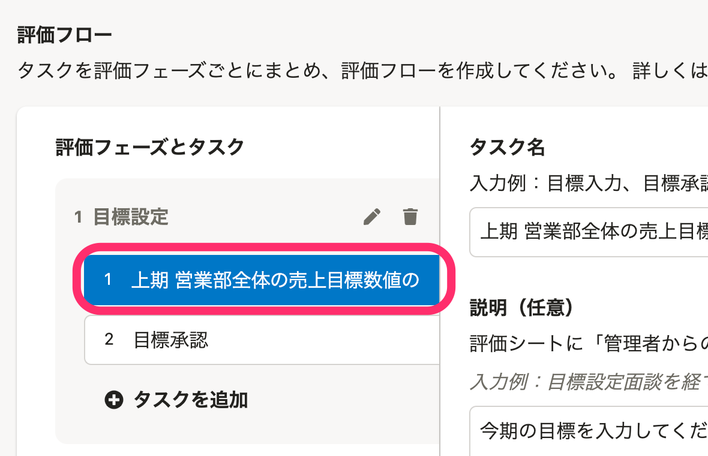
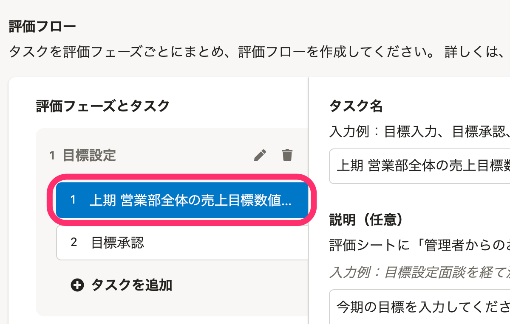
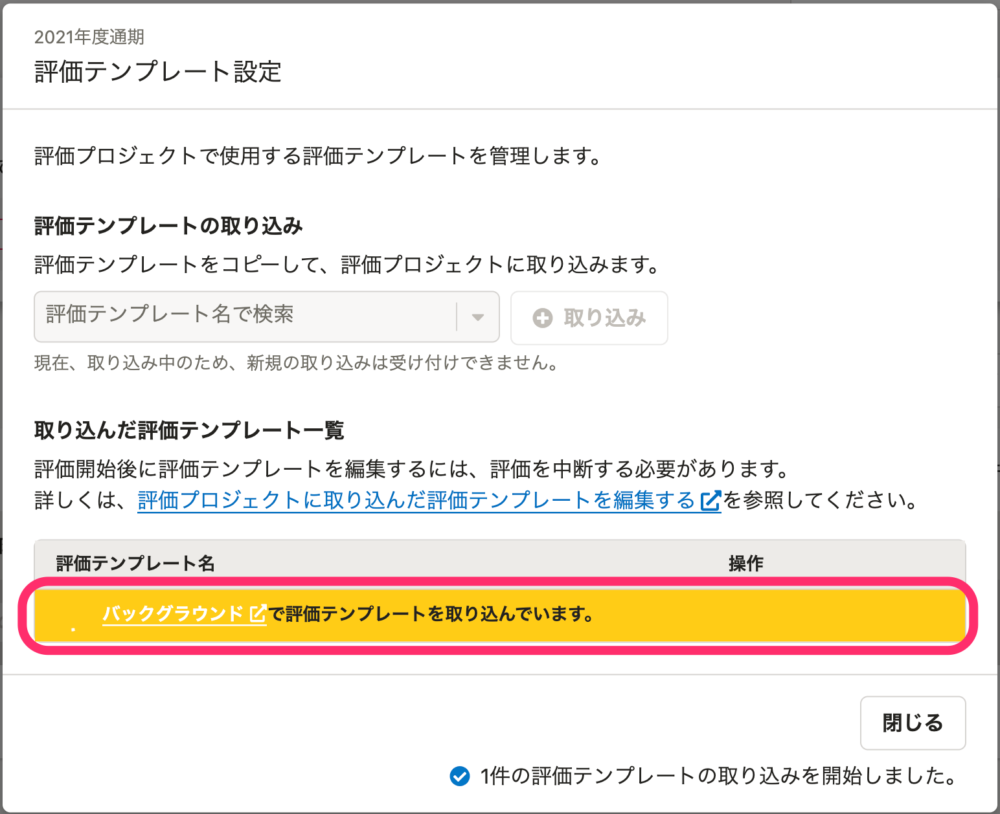
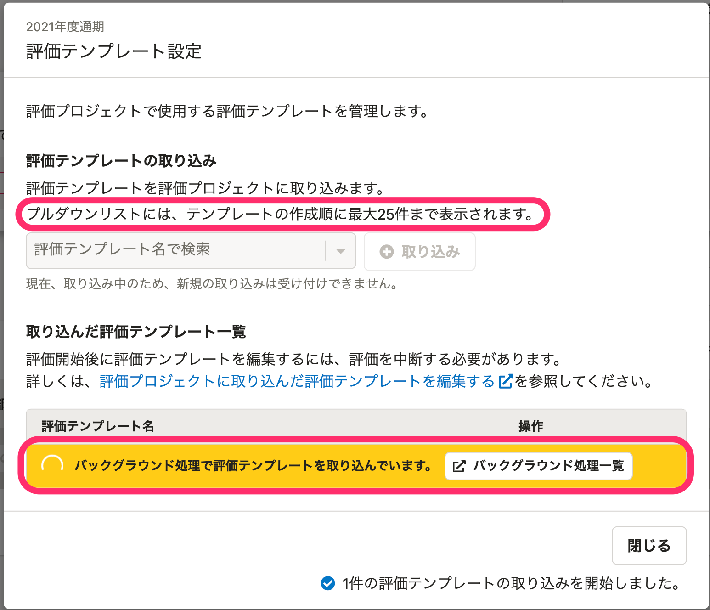

2022年01月06日（木）〜2022年01月11日（火）に行なったアップデートの詳細をお知らせします。

人事評価機能の変更点は、改善3件、不具合修正1件でした。

# ⚡️🚸💬改善

## 評価対象者が多い場合の評価対象者一覧画面のパフォーマンスを改善しました

従業員側の **［評価対象者一覧］** の画面を表示する際に、評価対象者が多い場合は画面の表示が遅くなる問題がありました。今回の変更によって、評価対象者が多い場合でも高速に表示されるように改善しました。

## 評価フローのタスク名が長い場合に文字が省略されるようにデザインを変更しました

評価テンプレートの **［評価フロー］** でタスク名が長い場合に、タスク名が見切れてしまう問題がありました。タスク名が長い場合は、文字が省略されていることが分かるようにデザインを変更しました。

| before | after |
| --- | --- |
|  |  |

## 評価テンプレート設定の画面のデザインを変更しました

評価プロジェクトの **［評価テンプレート設定］** の説明や、バックグラウンド処理をより適切な文言に変更しました。

| before | after |
| --- | --- |
|  |  |

# 🐛不具合修正

## 評価テンプレートの取り込みで、評価テンプレートの候補一覧が少なく表示される不具合を修正しました

評価プロジェクトの **［評価テンプレート設定］** の評価テンプレートの取り込みを行う際に、すでに取り込まれているテンプレートがある場合は表示される候補が少なくなる不具合がありました。

すでに取り込まれているテンプレートがある場合でも最大25件の候補が表示されるように修正しました。
