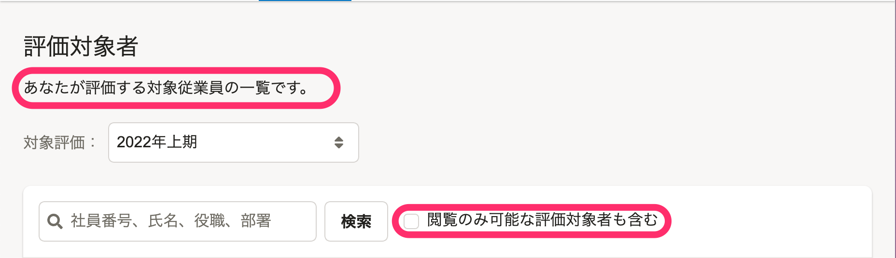
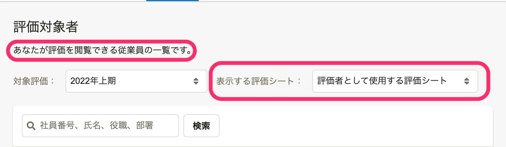
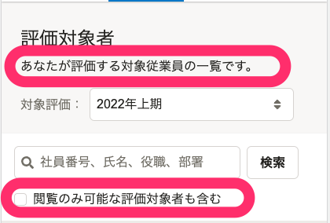
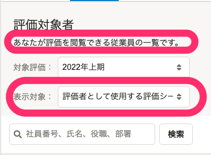

2022年01月18日（火）〜2022年01月24日（月）に行なったアップデートの詳細をお知らせします。

人事評価機能の変更点は、改善1件、不具合修正1件でした。

# 🚸💬改善

## 評価対象者一覧に表示する対象をプルダウンリストの選択で切り替えられるようにしました

従業員モードで利用する **［評価対象者一覧］** の画面で、自分自身がタスクの担当者である評価シートを絞り込みたいという要望がありました。

そこで、［ **表示する評価シート］** という項目を追加して、一覧に表示する対象をプルダウンリストから選択して切り替えられるようにしました。

また、一覧に表示される従業員の説明についても適切な文言に修正しました。

「表示する評価シート」で選択できる項目は下記の通りです。

| **ラベル** | **選択時に表示される評価シート** |
| --- | --- |
| 閲覧できるすべての評価シート | 評価者・評価共有者に自身が含まれる評価シート |
| 評価者として使用できる評価シート | 評価者に自身が含まれる評価シート |
| 確認・入力が必要な評価シート | 現在のタスク担当者が自身である評価シート |

画面の変更点

|   | **before** | **after** |
| --- | --- | --- |
| **デスクトップ** |  |  |
| **モバイル** |  |  |

# 🐛不具合修正

## 評価シートの表示速度が遅い問題を修正しました

 **［評価シート］** の **［表組み］** に設定されたフォームが多い場合に、 **［評価シート詳細］** 画面の表示速度が遅くなる問題がありました。 **［表組み］** に設定されたフォームが多い場合でも、表示速度が遅くならないように修正しました。
